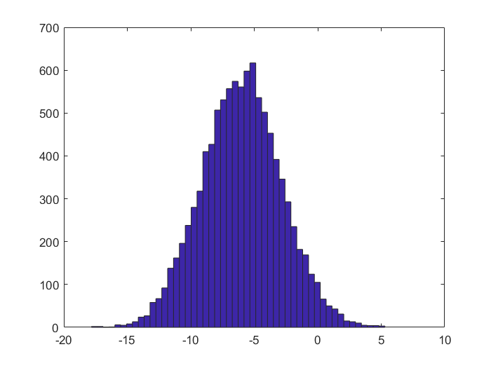

# 加减乘除次方
可以直接对标量进行加减乘除和次方操作
```matlab
1+1
2-1
3*4
10/2
2^6
```
# 逻辑运算
使用`==`,`>=`,`<=`,`~=`(不等于),`||`,`&&`,`xor`等进行操作
```matlab
2>=1;
1<=2;
1==1;
1~=1;
1||0;
1&&0;
xor(1,0);
```

# 屏幕输出
使用`disp`指令
```matlab
a=pi;
dsip(a);
```
或者
```matlab
disp(sprintf('2 decimals:%0.2f',a));
```
这是一种类似C语言的输出控制

# 向量和矩阵
用`[]`表示**矩阵**，用`;`表示**换行**，用**空格**隔开不同数字，如
```matlab
A=[1 2;3 4;5 6];
```
对于**行向量**和**列向量**
```matlab
v1=[1 2 3];
v2=[1;2;3];
```
也可以用两个`:`来生成向量，如
```matlab
v=0:0.2:1;
```
得到的v就是[0 0.2 0.4 0.6 0.8 1]

当然也可以省略最后一个数即步长，步长默认为1，如
```matlab
v=1:6;
```
得到的v就是[1 2 3 4 5 6]

# ones zeros eye
这三个指令可以快速生成矩阵，`ones`生成的矩阵元素值都为1，`zeros`都为0，`eye`生成的是单位阵，主对角线值为1，其他为0。
```matlab
A=ones(5);
```
# rand randn
`rand`可以生成一个指定大小的矩阵，其元素值大小为$[0,1]$之间的随机值。如
```matlab
rand(3,3);
```


`randn`生成的矩阵服从高斯分布
```matlab
randn(1,3);
```


# hist绘制直方图
使用`hist`可以绘制直方图，如
```matlab
 w=-6+sqrt(10)*(randn(1,10000));
 hist(w,50)
 ```

 

 # size
 `size`可以求出相应的尺寸，如
 ```matlab
 A=[1 2;3 4;5 6;7 8];
 size(A);
 ```
 返回的是一个行向量$[4,2]$,第一个表示矩阵的行数，第二个表示矩阵的列数。

 也可以用`size(A,1)`和`size(A,2)`分别求A的行数和列数，返回值分别为4和2.
# pwd
`pwd`可以得到当前的路径。
# cd
`cd`可以进入每一路径，使用时路径要加`'`
 # ls
 `ls`用于列出文件夹的所有内容。
# 读入数据
对于已有的数据文件，可以直接使用`load`进行读取，如
```matlab
load hello.mat
```
或者
```matlab
load('hello.mat')
```
# who和whos
`who`命令会列出当前工作空间的所有变量，`whos`则更加详细。

# 删除变量
若想删除某个变量可以使用clear

# 保存数据
使用`save`命令可以存储数据，如
```matlab
save hello.mat v
```
或者将其保存为txt格式
```matlab
save hello.txt v -ascii
```

# 矩阵索引
`A(x,y)`可以得到$x$行$y$列的元素值。
若在某个位置使用冒号，则表示取该行或该列的所有元素，如
`A(2,:)返回第二行所有元素，`A(:,2)`返回第二列所有元素。
`A(:)`把A中的所有元素放入一个单独的列向量，这样我们就得到了一个 9×1 的向量，这些元素都是A中的元素排列起来的。
# 矩阵合并
使用形如`A=[A,[100,101,102]]`的指令可以在A右侧再加一列。

`C=[A B]`直接将两个矩阵合并。

`C=[A;B]`将B矩阵拼到A下方。

# 矩阵运算
两个可以相乘的矩阵可以直接用`A*B`计算


使用`A.*B`可以进行点乘运算，及对应位置相乘


同样的，也可以使用`./`和`.^`等符号。

对数`log(A)`、`exp(A)`、绝对值`abs(A)`和逻辑运算（如`A<=3`）也会对每个值进行运算。

# 转置和逆
转置：`A'`

逆：`pinv(A)`

# 矩阵的常用函数
`max(A)`返回每一列的最大值，生成一个行向量。

如果A是一个列向量则返回值就是其最大值。如果A是普通矩阵可以通过`max(max(A))`或者`max(A(:))`找到其最大值。

对于列向量，还可以使用`[val,ind]=max(A)`返回最大值和其索引。

`max(A,[],1)`得到每一列的最大值,`max(A,[],2)`得到每一行的最大值.

`find()`会返回符合条件的值的索引。如`[r,c]=find(A<3)`会但会对应的行和列。

`magic(n)`会生成一个魔方矩阵，每一行、每一列、每一个对角线三个数字加起来都是等于同一个数。

`sum(A)`将每一列的元素相加，得到一个行向量。

`sum(A,2)`得到A中每一行的和。

`prod(A)`将每一列的元素相乘，得到一个行向量。

`floor(A)`向下四舍五入，`ceil(A)`向上四舍五入。

`flipud(A)`将数组从上向下翻转.

# 绘图
使用`plot`可以绘制对应的图。如
```matlab
x=0:0.01:0.98;
y1=sin(2*pi*x);
plot(x,y1);
```


接下来若再次使用`plot`会将原来的图覆盖，此时可以使用`hold on`，即在原来的图的基础上继续绘制。如
```matlab
hold on
y2=cos(2*pi*x);
plot(x,y2)
```


`plot()`可在y之后加入一个表示颜色的字符，如`'r'`表示红色。

`xlabel`用来添加横坐标，`ylabel`用来添加纵坐标。`legend`用来标记曲线，`title`用来写标题。如
```matlab
xlabel('time');
ylabel('value');
legend('sin','cos');
title('my plot')
```

.bmp)

`print –dpng 'myplot.png'`可以用于保存图片

同时也可以对figure进行标号,如`figure(1)`，这样可以生成多个绘图窗口。

`subplot`命令可以将窗口分为多个区域，`subplot(1,2,1)`表示分为1行2列，现在处理第1个图。`axis`可以改变轴的刻度。如
```matlab
subplot(1,2,1);
plot(x,y1);
subplot(1,2,2);
plot(x,y2);
axis([0.5 1 -1 1])
```


`clf`可以清楚除一副图像。

`imagesc`可以将一个矩阵可视化。如
```matlab
A=magic(10);
imagesc(A);
```


也可以使用`imagesc(A)，colorbar，colormap gray`，后两个命令分别生成一个颜色栏和生成灰度分布图，得到以下的图像。


# 控制语句
## for

```matlab
for index = 1:n
    
end
```

也可以加入`break`和`continue`.
## while
```matlab
while condition
    
end
```
## if
```matlab
if condition
    
end
```

# 函数
创建函数，需要创建一个.m文件，然后需要函数名，返回值和输入。比如函数square。
```matlab
function y = square(x)

    y=x^2;
end
```
调用时跟普通的函数一样，`y=square(5)`即可将y的值变为25。

# 向量化
向量化是一种思想。比如我的线性回归函数是$\displaystyle \sum_{j=0}^{n} \theta_j x_j$

如果直接运算，那么代码会是
```matlab
prediction=0.0;
for j=1:n+1
    prediction=prediction+theta(j)*x(j)
end;
```

但如果我们将其看作是$\theta^T$和$X$的乘积，那么我们只需要
```matlab
prediction=theta'*X
```
这样向量化的实现更简单，它运行起来也将更加高效.
