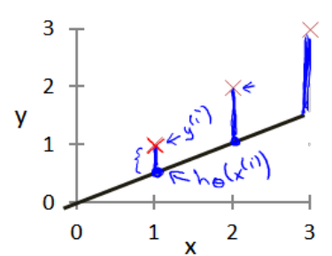
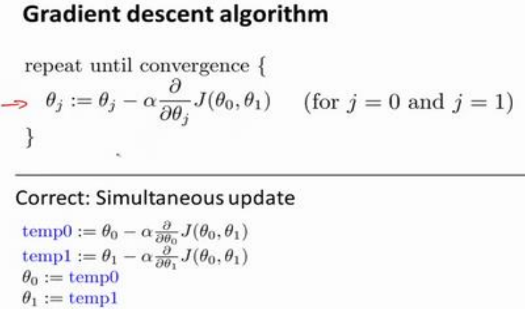

# 模型介绍

预测房价是一个回归问题。
假设训练集如下图所示

$m$代表训练集中实例的数量
$x$代表特征/输入变量
$y$代表目标变量/输出变量
`(x,y)` 代表训练集中的实例
$(x^{(i)},y^{(i)})$ 代表第$i$个观察实例
$h$代表学习算法的解决方案或函数也称为假设（hypothesis）

$h$是从$x$到$y$的映射
一种可能的表达方式为:
$h_{\theta}(x)=\theta_0+\theta_1x$
因为只含有一个特征/输入变量，因此这样的问题叫作单变量线性回归问题.

# 代价函数

**假设函数**，也就是用来进行预测的函数，是这样的线性函数形式：$h_{\theta}(x)=\theta_0+\theta_1x$
接下来我们会引入一些术语我们现在要做的便是为我们的模型选择合适的参数(parameters)$\theta_0$和$\theta_1$,在房价问题这个例子中便是直线的斜率和在$y$轴上的截距。

我们的目标便是选择出可以使得建模误差的平方和能够最小的模型参数。 即使得代价函数$\displaystyle J\left(\theta_0,\theta_1\right)=\frac{1}{2m}\sum_{i=1}^{m}\left(h_{\theta}(x^{(i)})-y^{(i)}\right)^2$最小。

绘制一个**等高线图**，三个坐标分别为$\theta_0$,$\theta_1$和$J\left(\theta_0,\theta_1\right)$

这种代价函数也被称作**平方误差函数**，有时也被称为平方误差代价函数。误差平方代价函数，对于大多数问题，特别是回归问题，都是一个合理的选择。还有其他的代价函数也能很好地发挥作用，但是平方误差代价函数可能是解决回归问题最常用的手段。
我们真正需要的是一种有效的算法，能够自动地找出这些使代价函数$J$取最小值的参数$\theta_0$和$\theta_1$。

# 梯度下降
梯度下降背后的思想是：开始时我们随机选择一个参数的组合$\displaystyle \left(\theta_0,\theta_1,\cdots,\theta_n\right)$，计算代价函数，然后我们寻找下一个能让代价函数值下降最多的参数组合。我们持续这么做直到到到一个局部最小值（local minimum），因为我们并没有尝试完所有的参数组合，所以不能确定我们得到的局部最小值是否便是全局最小值（global minimum），选择不同的初始参数组合，可能会找到不同的局部最小值。
批量梯度下降（batch gradient descent）算法的公式为：
$\theta_j:=\theta_j-\alpha\frac{\partial}{\partial\theta_j}J\left(\theta_0,\theta_1\right)\qquad\left(for\;j=0\;and\;j=1\right)$

$\alpha$是学习率。它决定了我们沿着能让代价函数下降程度最大的方向向下迈出的步子有多大，在批量梯度下降中，我们每一次都同时让所有参数减去学习速率乘以代价函数的导数。
在梯度下降算法中，还有一个更微妙的问题，梯度下降中，我们要更新$\theta_0,\theta_1$，当$\;j=0\;$和$\;j=1\;$时，会产生更新，所以你将更新$J(\theta_0)$和$J(\theta_1)$。实现梯度下降算法的微妙之处是，在这个表达式中，如果你要更新这个等式，你需要同时更新$\theta_0,\theta_1$,意思是在这个等式中，我们要这样更新：$\theta_0:=\theta_0$，并更新$\theta_0:=\theta_0$。实现方法是：你应该计算公式右边的部分，通过那一部分计算出$\theta_0,\theta_1$的值，然后同时更新$\theta_0,\theta_1$.

