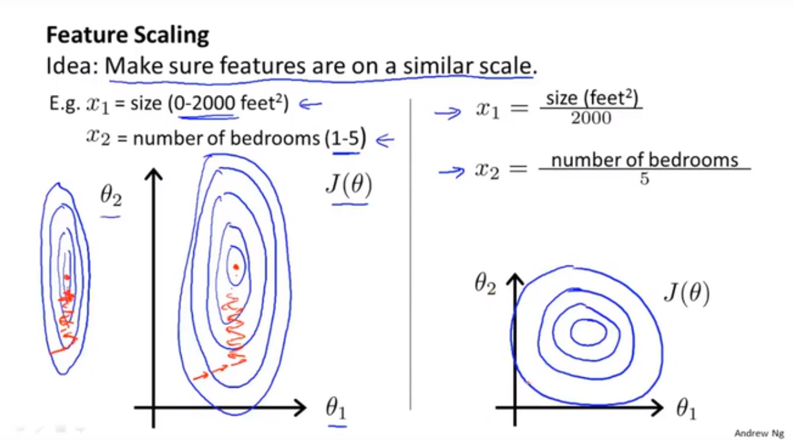
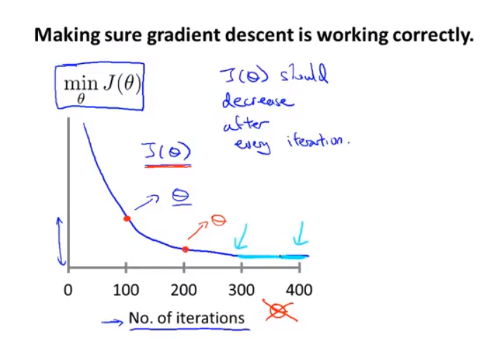
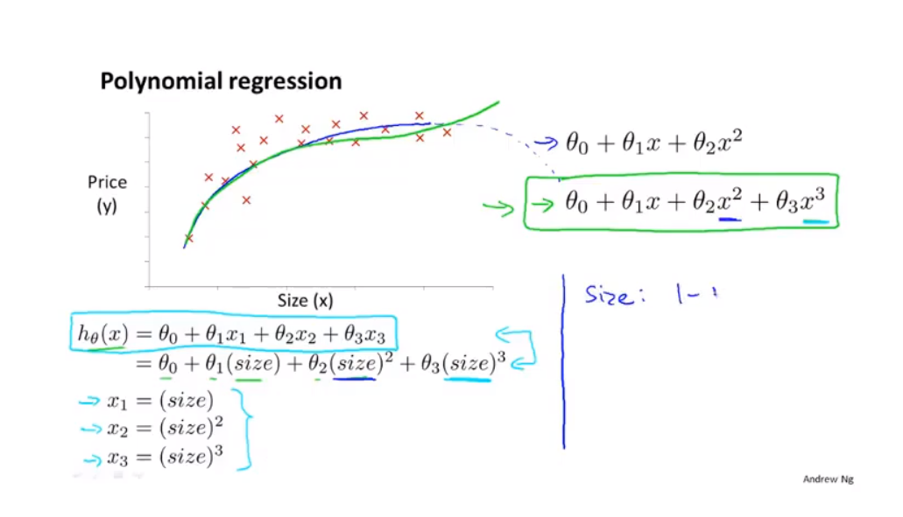
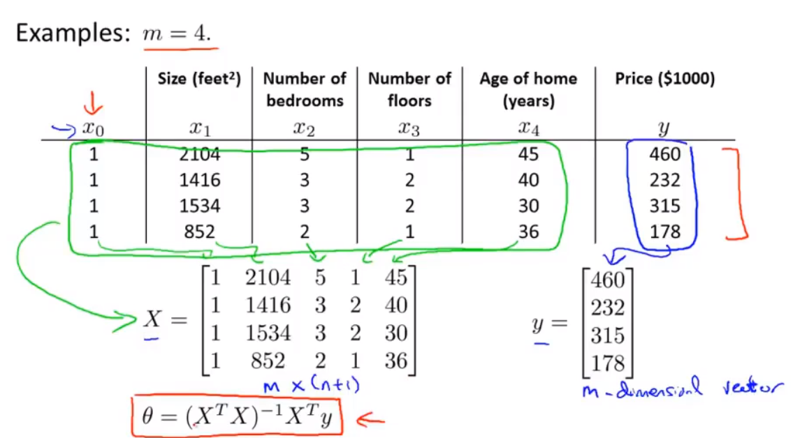

# 多变量
假设函数：$h_\theta(x)=\theta^Tx=\theta_0x_0+\theta_1x_1+\cdots+\theta_nx_n\\$
参数：$\theta_0,\theta_1,\cdots,\theta_n\rightarrow \theta\\$
代价函数：$\displaystyle J(\theta)=\frac{1}{2m}\sum_{1=1}^{m}(h_\theta(x^{(i)})-y^{(i)})^2\\$
梯度下降：

$
\begin{aligned}
repeat\{\\
&\theta_j:=\theta_j-\alpha\frac{\partial}{\partial\theta_j}J(\theta)\\
&\}\qquad (simultaneously\;update\;for\;every\;j=0,\cdots,n)\\
\end{aligned}
$

# 特征缩放

如图，特征$x_1$的取值为$(0,2000)$,特征$x_2$的取值为$[1,5]$,由此得到的等高线图会非常瘦，那么下降的速度也会较慢。因此需要进行特征缩放。将$x_1$缩小2000倍，$x_2$缩小5倍，他们的值就更加接近，收敛更快。

特征缩放一般将特征值缩放到$[-1,1]$的范围内，但也不绝对，只需接近即可，如$[0,3],[-0.5,2]$这些都是可以接受的缩放。

# 均值归一化(mean normalization)
均值归一化会将特征缩放到均值为0的对称区间

$x_1\rightarrow \frac{x_1-\mu_1}{s_1}\\$
其中$\mu_1$是$x_1$的均值，$s_1$是$x_1$的范围。

# 学习率$\alpha$
**确保梯度下降正确工作的方法**

绘制一个迭代次数与$J(\theta)$的关系图，$J(\theta)$应在每次迭代后下降，同时在图中可以观察到差不多停止下降的位置$(300)$。

可以对梯度下降进行收敛测试，即选择一个阈值$\varepsilon$,若每次下降的值小于阈值$\varepsilon$，则认为其收敛。然后阈值$\varepsilon$的选择非常困难，最好还是通过观察图像进行判断。

一般的问题都可以通过减小学习率$\alpha$解决，但太小的$\alpha$会导致收敛太慢。

可以尝试3倍改变$\alpha$进行测试。
# 多项式回归

采用多项式，如二次或三次，可以将$size$作为$x_1$，$size^2$作为$x_2$,$size^3$作为$x_3$,同时也要注意特征缩放

# 正规方程(normal equation)

可以使用$\displaystyle \theta=(X^TX)^{-1}X^Ty$求解$\theta$的值。求解时可以不进行特征缩放。

在matlab中。可以使用$\;pinv(X'*X)*X'*y$计算

$pinv=pseudo\;inverse(伪逆)$，即使$(X^TX)$没有逆矩阵，也能计算出正确的$\theta$

梯度下降与正规方程的优劣

||梯度下降法|正规方程法|
|---|---|---|
|优点|对于很大的$n$也能很好的计算|不需要选择学习率$\alpha\\$不需要迭代|
|缺点|需要选择学习率$\alpha\\$需要多次迭代|需要计算$(X^TX)^{-1}$,复杂度在$O(n^3)\\$$n$很大时速度较慢

若$(X^TX)$不可逆，可能是因为有多余的特征线性相关，需要将其删除
