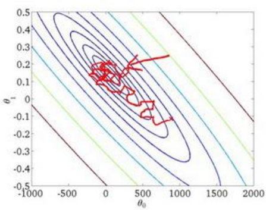
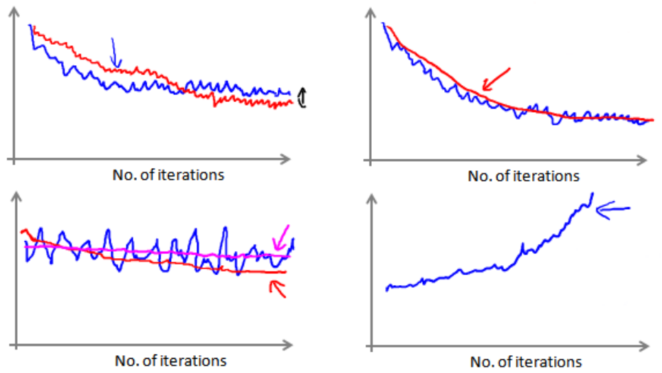

# 随机梯度下降(Stochastic Gradient Descent)
在随机梯度下降法中,我们将代价函数定义为单一训练的代价
$$
cost(\theta,(x^{(i)},y^{(i)}))=\frac{1}{2}(h_\theta(x^{(i)})-y^{(i)})^2
$$

在使用随机梯度下降时,首先对训练集随机“洗牌”,然后

$
\text{Repeat}\{\\
\quad\text{for }i=1,\cdots,m\{\\
  \qquad \theta_j:=\theta_j-\alpha(h_\theta(x^{(i)})-y^{(i)})x_j^{i}\\
 \qquad\qquad \text{(for every }j=0,\cdots,n)\\
\quad\}\\
\}
$

随机梯度下降算法在每一次计算之后便更新参数$\theta$，而不需要首先将所有的训练集求和，在梯度下降算法还没有完成一次迭代时，随机梯度下降算法便已经走出了很远。但是这样的算法存在的问题是，不是每一步都是朝着”正确”的方向迈出的。因此算法虽然会逐渐走向全局最小值的位置，但是可能无法站到那个最小值的那一点，而是在最小值点附近**徘徊**。

# 小批量梯度下降(Mini-Batch Gradient Descent)
小批量梯度下降算法是介于批量梯度下降算法和随机梯度下降算法之间的算法，每计算常数$b$次训练实例，便更新一次参数$\theta$。

$
\text{Repeat}\{\\
\quad\text{for }i=1:m\{\\
  \qquad \theta_j:=\theta_j-\alpha\frac{1}{b}\sum_{k=i}^{i+9}(h_\theta(x^{(k)})-y^{(k)})x_j^{k}\\
 \qquad\qquad \text{(for every }j=0,\cdots,n)\\
\qquad i+=b;\\
\quad\}\\
\}
$

通常我们会令$b$在 2-100 之间。这样做的好处在于,我们可以用向量化的方式来循环$b$个训练实例，如果我们用的线性代数函数库比较好，能够支持平行处理，那么算法的总体表现将不受影响（与随机梯度下降相同）

# 随机梯度下降收敛
在随机梯度下降中，我们在每一次更新$\theta$之前都计算一次代价，然后每$x$次迭代后，求出这$x$次对训练实例计算代价的**平均值**，然后绘制这些平均值与$x$次**迭代次数**之间的函数图表。

当我们绘制这样的图表时，可能会得到一个颠簸不平但是不会明显减少的函数图像（如上面左下图中蓝线所示）。我们可以增加$\alpha$来使得函数更加平缓，也许便能看出下降的趋势了（如上面左下图中红线所示）

或者可能函数图表仍然是颠簸不平且不下降的（如洋红色线所示），那么我们的模型本身可能存在一些错误。

如果我们得到的曲线如上面右下方所示，不断地上升，那么我们可能会需要选择一个较小的学习率$\alpha$。

有一种方法可以使学习率$\alpha$随着训练次数增加而减小,即
$$
\alpha=\frac{const1}{iterationNumber+const2}
$$
但是这么做的话有需要调整常数1和2的数值,这并不是一个很好的方法.

# 在线学习
现在的很多网站都有在线学习的机制,假设我们正在经营一家物流公司，每当一个用户询问从地点 A 至地点 B 的快递费用时，我们给用户一个报价，该用户可能选择接受$(y=1)$或不接受$(y=0)$。

现在，我们希望构建一个模型，来预测用户接受报价使用我们的物流服务的可能性。因此报价是我们的一个特征，其他特征为距离，起始地点，目标地点以及特定的用户数据。模型的输出是:$p(y=1|x;\theta)$。

$
\text{Repeat forever}\{\\
\text{Get }(x,y)\text{ corresponding to the current user}\\
\theta_j:=\theta_j-\alpha(h_\theta(x)-y)x_j\\
\}
$

每学习完一个数据,便丢弃掉一个数据.这种方式的好处在于，我们的算法可以很好的适应用户的**倾向性**，算法可以针对用户的当前行为**不断地更新**模型以适应该用户。

在线学习的一个优点就是，如果你有一个变化的用户群，又或者你在尝试预测的事情，在缓慢变化，就像你的用户的品味在缓慢变化，这个在线学习算法，可以慢慢地调试你所学习到的假设，将其调节更新到最新的用户行为。

# mapreduece和数据并行

其做法就是,将很大的数据集划分为几份,分配给多台计算机计算,最后在合并.

比如我有400个数据,可以分配给4台计算机处理

|Machine no.|Samples|Computation|
|---|---|---|
|1|1-100|$\displaystyle temp^{(1)}=\sum_{i=1}^{100}(h_\theta(x^{(i)})-y^{(i)})x_j^{i}$|
|2|101-200|$\displaystyle temp^{(2)}=\sum_{i=101}^{200}(h_\theta(x^{(i)})-y^{(i)})x_j^{i}$|
|3|201-100|$\displaystyle temp^{(3)}=\sum_{i=201}^{300}(h_\theta(x^{(i)})-y^{(i)})x_j^{i}$|
|4|301-400|$\displaystyle temp^{(4)}=\sum_{i=301}^{400}(h_\theta(x^{(i)})-y^{(i)})x_j^{i}$|

最后的结果$\theta_j:=\theta_j-\alpha\frac{1}{400}(temp^{(1)}+temp^{(2)}+temp^{(3)}+temp^{(4)})$

很多高级的线性代数函数库已经能够利用多核 CPU 的多个核心来并行地处理矩阵运算，这也是算法的向量化实现如此重要的缘故（比调用循环快）。