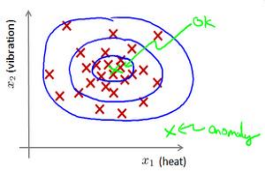

# 问题动机
什么是异常检测呢？为了解释这个概念，让我举一个例子吧：

假想你是一个飞机引擎制造商，当你生产的飞机引擎从生产线上流出时，你需要进行QA(质量控制测试)，而作为这个测试的一部分，你测量了飞机引擎的一些特征变量，比如引擎运转时产生的热量，或者引擎的振动等等。

这样一来，你就有了一个数据集，从$x^{(1)}$到$x^{(m)}$，如果你生产了$m$个引擎的话，你将这些数据绘制成图表

而如果有一天,新生产出一个引擎,引擎的特征变量为$x_{test}$,我们想知道这个引擎是否存在异常,这就是异常检测问题.

给定数据集$x^{(1)},x^{(2)},\cdots x^{(m)}$，我们假使数据集是正常的，我们希望知道新的数据$x_{test}$是不是异常的，即这个测试数据不属于该组数据的几率如何。我们所构建的模型应该能根据该测试数据的位置告诉我们其属于一组数据的可能性 $p(x)$。

上图中，在蓝色圈内的数据属于该组数据的可能性较高，而越是偏远的数据，其属于该组数据的可能性就越低。

这被称为密度估计
$$
\text{if}\;p(x)
\begin{cases}
    <\epsilon\qquad\text{anomaly}\\
    \geq\epsilon\qquad\text{normal}
\end{cases}
$$

# 高斯分布(Gaussian Distribution)

高斯分布也称正态分布.符合高斯分布的变量表示为$x\sim N(\mu,\sigma^2)$.

概率密度函数为
$$
p(x,\mu,\sigma^2)=\frac{1}{\sqrt{2\pi}\sigma}\exp(-\frac{(x-\mu)^2}{2\sigma^2})
$$

$\mu$和$\sigma$的计算方式分别为
$$
\displaystyle
\mu=\frac{1}{m}\sum_{i=1}^{m}x^{(i)}\\
\sigma^2=\frac{1}{m}\sum_{i=1}^m(x^{(i)}-\mu)^2
$$

$\mu$影响峰的位置,$\sigma$影响峰的宽度和高度

在机器学习中,我们一般使用$\frac{1}{m}$,在统计学中,一般使用$\frac{1}{m-1}$.

# 算法

对于给定数据集$x^{(1)},x^{(2)},\cdots x^{(m)}$,我们先对每一个特征计算$\mu$和$\sigma^2$的估计值.
$$
\displaystyle
\mu_j=\frac{1}{m}\sum_{i=1}^{m}x_j^{(i)}\\
\sigma^2_j=\frac{1}{m}\sum_{i=1}^m(x_j^{(i)}-\mu_j)^2
$$
对于新的实例,可用下式计算其$p(x)$
$$
\displaystyle
p(x)=\prod_{j=1}^np(x_j;\mu_j,\sigma_j^2)=\prod_{j=1}^n\frac{1}{\sqrt{2\pi}\sigma_j}\exp(-\frac{(x_j-\mu_j)^2}{2\sigma_j^2})
$$

若$p(x)<\epsilon$,则为异常.

# 开发和评价一个异常检测系统
异常检测算法是一个无监督学习算法,我们无法从$y$的值判断是否真的异常.

我们从们需要另一种方法来帮助检验算法是否有效。当我们开发一个异常检测系统时，我们从**带标记**（异常或正常）的数据着手，我们从其中选择一部分正常数据用于构建训练集，然后用剩下的正常数据和异常数据混合的数据构成交叉检验集和测试集。

例如：我们有 10000 台正常引擎的数据，有 20 台异常引擎的数据。 我们这样分配数据：

6000 台正常引擎的数据作为训练集

2000 台正常引擎和 10 台异常引擎的数据作为交叉检验集

2000 台正常引擎和 10 台异常引擎的数据作为测试集

具体的评价方法如下：
1. 根据测试集数据，我们估计特征的平均值和方差并构建$p(x)$函数
2. 对交叉检验集，我们尝试使用不同的$\epsilon$值作为阀值，并预测数据是否异常，根据 F1 值或者查准率与查全率的比例来选择$\epsilon$
3. 选出$\epsilon$后，针对测试集进行预测，计算异常检验系统的F1值，或者查准率与查全率之比。

# 异常检测与监督学习对比

异常检测:

1. 非常少量的正向类(异常数据$y=1$), 大量的负向类($y=0$)
2. 许多不同种类的异常，非常难。根据非常少量的正向类数据来训练算法。
3. 未来遇到的异常可能与已掌握的异常、非常的不同。
4. 例如： 欺诈行为检测,生产(例如飞机引擎),检测数据中心的计算机运行状况
   
监督学习:

1. 同时有大量的正向类和负向类
2. 有足够多的正向类实例，足够用于训练算法，未来遇到的正向类实例可能与训练集中的非常近似。
3. 例如：邮件过滤器 天气预报 肿瘤分类

# 选择特征
异常检测假设特征符合**高斯分布**，如果数据的分布不是高斯分布，异常检测算法也能够工作，但是最好还是将数据转换成高斯分布,比如对数,指数,开方等.

一个常见的问题是一些异常的数据可能也会有较高的$p(x)$值，因而被算法认为是正常的。

这种情况下误差分析能够帮助我们，我们可以分析那些被算法错误预测为正常的数据，观察能否找出一些问题。我们可能能从问题中发现我们需要**增加一些新的特征**，增加这些新特征后获得的新算法能够帮助我们更好地进行异常检测。

我们通常可以通过将一些相关的特征进行**组合**，来获得一些新的更好的特征（异常数据的该特征值异常地大或小），例如，在检测数据中心的计算机状况的例子中，我们可以用 CPU负载与网络通信量的比例作为一个新的特征，如果该值异常地大，便有可能意味着该服务器是陷入了一些问题中。

# 多元高斯分布
多元高斯分布一般对相关的特征使用.计算方式为
$$
\mu=\frac{1}{m}\sum_{i=1}^{m}x^{(i)}\\
\Sigma=\frac{1}{m}\sum_{i=1}^m(x^{(i)}-\mu)(x^{(i)}-\mu)^T\\
p(x,;\mu,\Sigma)=\frac{1}{(2\pi)^{\frac{n}{2}}|\Sigma|^{\frac{1}{2}}}\exp(-\frac{1}{2}(x-\mu)^T\Sigma^{-1}(x-\mu))
$$

上图是 5 个不同的模型，从左往右依次分析：
1. 是一个一般的高斯分布模型
2. 通过协方差矩阵，令特征 1 拥有较小的偏差，同时保持特征 2 的偏差
3. 通过协方差矩阵，令特征 2 拥有较大的偏差，同时保持特征 1 的偏差
4. 通过协方差矩阵，在不改变两个特征的原有偏差的基础上，增加两者之间的正相关性
5. 通过协方差矩阵，在不改变两个特征的原有偏差的基础上，增加两者之间的负相关性

可以证明的是，原本的高斯分布模型是多元高斯分布模型的一个**子集**，即像上图中的第1、2、3，3 个例子所示，如果协方差矩阵只在对角线的单位上有非零的值时，即为原本的高斯分布模型了。

原高斯分布模型和多元高斯分布模型的比较

|原高斯分布模型|多元高斯分布模型|
|---|---|
|不能捕捉特征之间的相关性,但可以通过将特征进行组合的方法来解决|自动捕捉特征之间的相关性|
|计算代价低，能适应大规模的特征|计算代价较高 训练集较小时也同样适用|
||必须要有$m>n$，不然的话协方差矩阵不可逆，通常需要$m>10n$,另外特征冗余也会导致协方差矩阵不可逆|

原高斯分布模型被广泛使用着，如果特征之间在某种程度上存在相互关联的情况，我们可以通过构造新新特征的方法来捕捉这些相关性。

如果训练集**不是太大**，并且**没有太多的特征**，我们可以使用多元高斯分布模型。