# 优化目标
根据之前学过的逻辑回归,

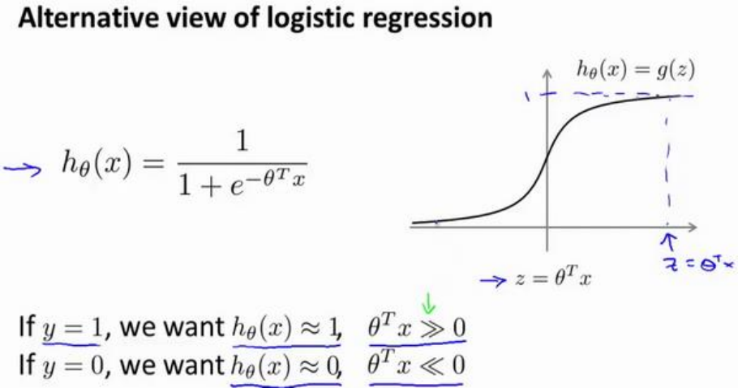

我们希望无论在训练集中,交叉验证集中,或是测试集中,如果有一个$y=1$的样本,那么$h_\theta(x)$应该趋于 1,$\theta^Tx$应当远大于0,而根据代价函数
$$
J=-y\log\frac{1}{1+e^{-\theta^Tx}}-(1-y)\log(1-\frac{1}{1+e^{-\theta^Tx}})
$$

$y=1$时,只有第一项起作用,而
$$
-\log\frac{1}{1+e^{-\theta^Tx}}
$$
随着$z=\theta^Tx$的增大而减小
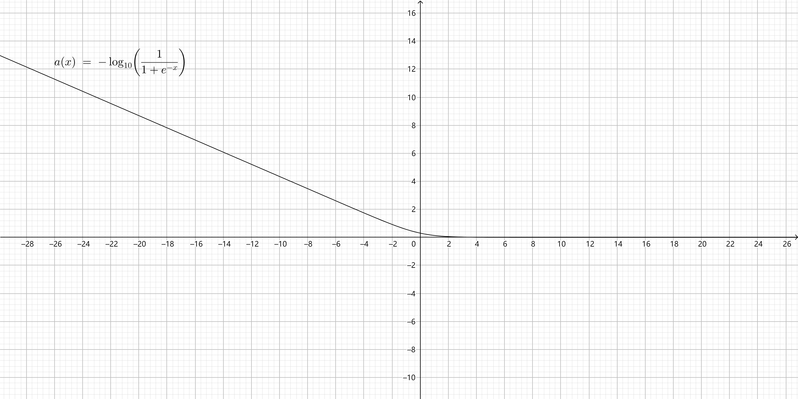

这也就解释了，为什么逻辑回归在观察到正样本$y=1$时，试图将$\theta^Tx$设置得非常大.$y=0$时也是同理.

现在开始建立支持向量机.

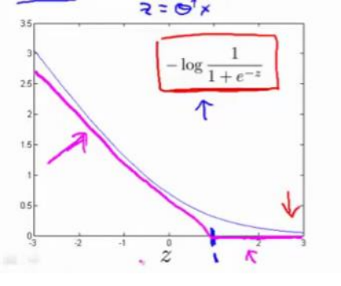

新的代价函数将会水平的从这里到右边(图外)，然后我再画一条同逻辑回归非常相似的直线，但是，在这里是一条直线，也就是我用紫红色画的曲线，就是这条紫红色的曲线。那么，到了这里已经非常接近逻辑回归中使用的代价函数了。只是这里是由两条线段组成，即位于右边的水平部分和位于左边的直线部分，先别过多的考虑左边直线部分的斜率，这并不是很重要.

支持向量机，带来计算上的优势.

$y=0$时的情况如下图.

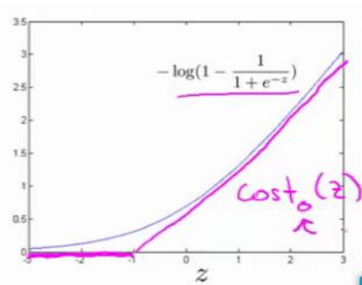

将第一个函数命名为$cost_1(z)$,第二个函数命名为$cost_0(z)$.

在逻辑回归中,我们需要找到时代价函数最小的$\theta$,即
$$
\displaystyle \underset{\theta}{min}\frac{1}{m}[\sum_{i=1}^{m}y^{(i)}(-\log h_\theta(x^{(i)}))+(1-y^{(i)})(-\log(1-h_\theta(x^{(i)})))]+\frac{\lambda}{2m}\sum_{j=1}^{n}\theta_j^2
$$

而在支持向量机中,将其改写为
$$
\displaystyle \underset{\theta}{min}C\frac{1}{m}[\sum_{i=1}^my^{(i)}cost_1(\theta^Tx^{(i)})+(1-y^{(i)})cost_0(\theta^Tx^{(i)})]+\frac{1}{2}\sum_{j=1}^{n}\theta_j^2
$$

我们去掉了式中的$m$,这是人们的书写习惯,当然因为$m$是常量,对最终的结果没有影响.

在支持向量机中,我们不将式子写成$A+\lambda B$的形式,而是写成$C\times A+B$的形式,当然也可以将$C$看做$\frac{1}{\lambda}$

最后有别于逻辑回归输出的概率。在这里，我们的代价函数，当最小化代价函数，获得参数$\theta$时，支持向量机所做的是它来直接预测$y$的值等于 1，还是等于 0。因此，这个假设函数会预测 1。当$\theta^Tx$大于或者等于 0 时，或者等于 0 时，所以学习参数$\theta$就是支持向量机假设函数的形式。那么，这就是支持向量机数学上的定义。

# 大间隔的直观理解

人们有时将支持向量机看作是大间距分类器。

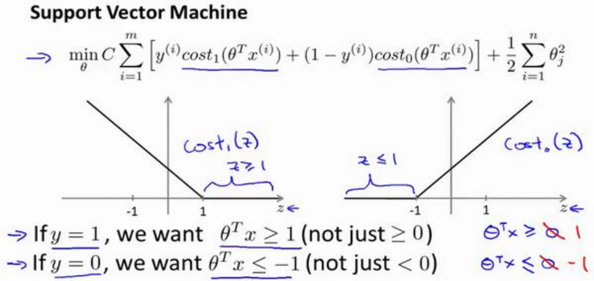

那么根据这张图,我们发现,要是代价函数最小,在$y=1$时,$\theta^Tx$不只是要$\geq 0$,而是要$\geq 1$.同理,$y=0$时,$\theta^Tx$不只是要$\leq 0$,而是要$\leq -1$.

这就相当于在支持向量机中嵌入了一个**额外的安全因子**，或者说安全的间距因子.当然逻辑回归也做了类似的事.

接下来我们考虑当$C$为100000或其他特别大的数时,会发生什么.

首先,对于一个如图数据集,可以看到其是线性可分的,存在很多条直线将正样本和负样本分开.

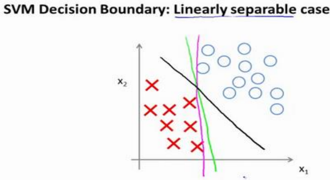

然而对于这个数据集来说,绿色和紫色的分割显然不如黑色.数学上来说,是因为他有更大的间距(margin).

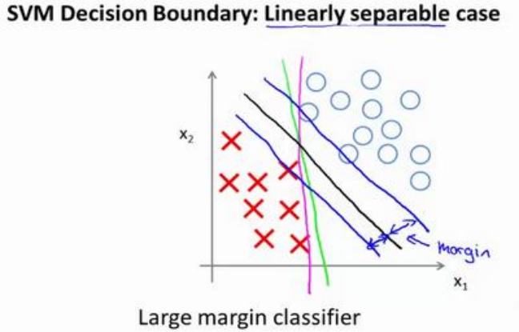

支持向量机会努力用一个最大间距去分离样本,这也是他具有鲁棒性的原因.支持向量机也被称为大间距分类器.

事实上，支持向量机现在要比这个大间距分类器所体现得更成熟，尤其是当你使用大间距分类器的时候，你的学习算法会受异常点(outlier) 的响.比如我们加入一个额外的正样本。

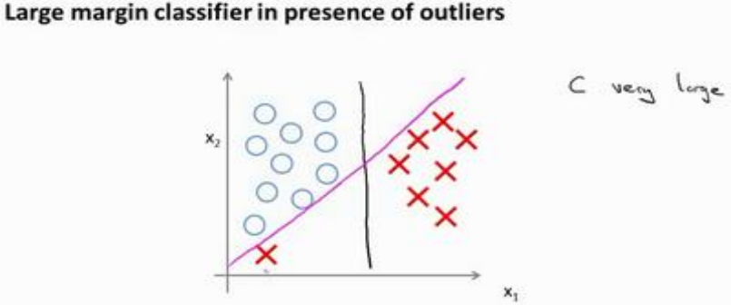

如果仅因为一个异常点,就将边界从黑线变为红线,那显然是不明智的.但是如果我们将$C$设置的很大,比如100000这样的数,他就会这么做.所以 C不要这是的太大.

回顾$C=\frac{1}{\lambda}$,
1. $C$大,相当于$\lambda$小,容易过拟合,高方差
2. $C$小,相当于$\lambda$大,容易欠拟合,高偏差.

# 大间隔分离器的数学原理

首先复习一下向量内积的知识.假设有两个向量,
$$
u=
\begin{bmatrix}
    u_1\\
    u_2\\
\end{bmatrix}
,
v=
\begin{bmatrix}
    v_1\\
    v_2\\
\end{bmatrix}
$$
,那么$u^Tv$就是他们的内积.因为时二维向量,可以将他们画出

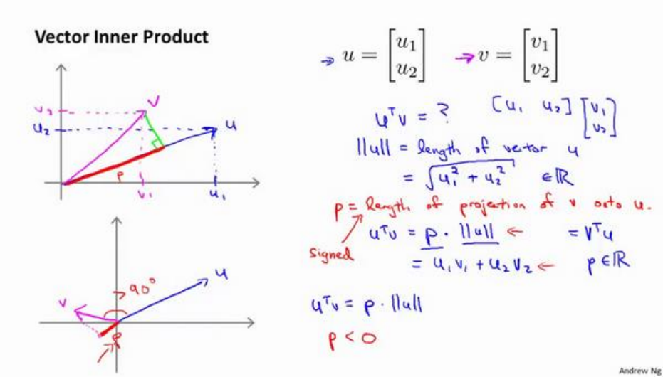

$u$的范数$||u||=\sqrt{u_1^{2}+u_2^{2}}$,也就是$u$的长度.我们可以将$v$投影到$u$上,即图中的$p$,那么$p||u||=u^Tv$.需要注意的是,p是可正可负的,比如图中左下角,当二者夹角大于90度时,p为负.

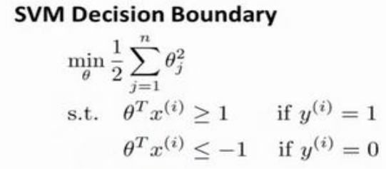

这就是我们先前给出的支持向量机模型中的目标函数。

首先我们忽略掉截距,即$\theta_0=0$,然后假设只有两个特征$x_1,x_2$,那么这个式子可以写成
$$
\frac{1}{2}(\theta_1^2+\theta_2^2)=\frac{1}{2}\left(\sqrt{\theta_1^2+\theta_2^2}\right)^2=\frac{1}{2}||\theta||^2
$$

那么现在要做的是,就是极小化参数$\theta$的范数的平方.

$\theta^Tx$的计算方法可以和之前提到的$u^Tv$一样.假设我们考察一个单一的样本$x^{(i)}$,我么可以在水平轴上取$x^{(i)}_1$,在竖直轴上取$x^{(i)}_2$,如图所示.那么它的内积$\theta^Tx^{(i)}$也可以使用投影的方式来计算,即
$$
\theta^Tx^{(i)}=p^{(i)}\cdot||\theta||
$$

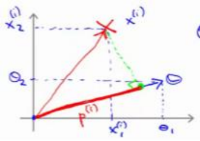

根据这个结论,我们对于下图的这个数据集进行优化.依然假设$\theta_0=0$.

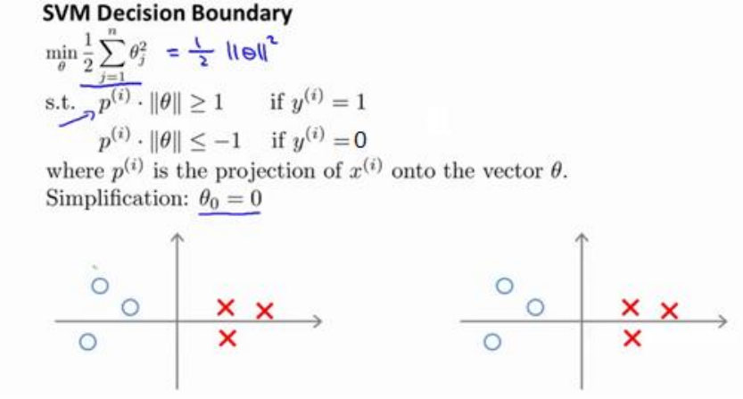

首先看第一种边界

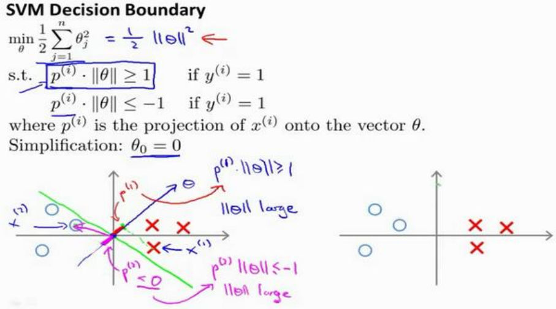

易得**边界**(绿色)和$\vec\theta$互相垂直.在$\theta_0=0$时,边界过原点.

对于图中$x^{(1)}$这个样本,他在$\vec{\theta}$上的投影为$p^{(1)}$,可以看到他非常短.类似的,对于样本$x^{(2)}$,它的投影$p^{(2)}$也非常短,这就需要$||\theta||$非常大.显然这不是很符合我们的要求.

让我们看另一个决策边界.

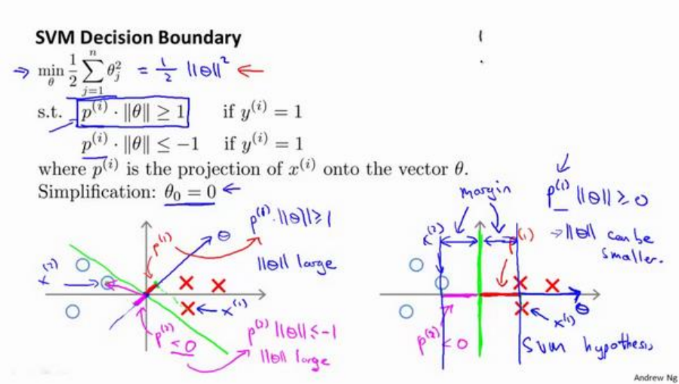

很显然,对于这种边界,样本在$\vec{\theta}$的投影要大很多,这样$||\theta||$就可以相应的减小.这也是支持向量机如何能有效地产生大间距分类的原因.

当然,即使$\theta_0\neq 0$,支持向量机也会找到正样本和负样本之间的大间距分隔。

# 核函数

给定一个训练实例$x$, 我们利用$x$的各个特征与我们预先选定的地标(landmarks)$l^{(1)},l^{(2)},l^{(3)}$的近似程度来选取新的特征。

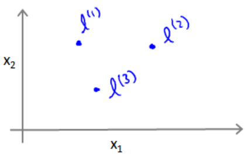

如$f_1=similarity(x,l^{(1)})=\exp(-\frac{||x-l^{(1)}||^2}{2\sigma^2})$.

其中,$\displaystyle||x-l^{(1)}||^2=\sum_{j=1}^{n}\left(x_j-l_j^{(1)}\right)^2$,是实例$x$中所有特征与地标$l^{(1)}$之间的距离的和.$similarity(x,l^{(1)})$就是核函数的一种,称为高斯核函数.

观察这个函数可以发现,当特征$x$与地标距离较远时,分子较大,函数的结果趋于0;反之距离近时,分子趋于0,函数的结果趋于1.

$\sigma^2$对函数的影响是:$\sigma^2$越大,下降越慢,$\sigma^2$越小,下降越快.

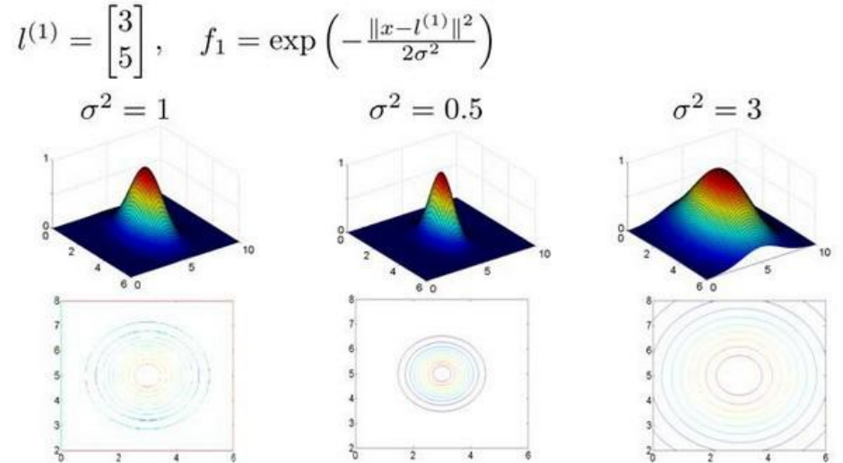

那么如何选择地标?

我们通常是根据训练集的数量选择地标的数量，即如果训练集中有$m$个实例，则我们选取$m$个地标，并且令:$l^{(1)}=x^{(1)},l^{(2)}=x^{(2)},\cdots,l^{(m)}=x^{(m)}$这样做的好处在于：现在我们得到的新特征是建立在原有特征与训练集中所有其他特征之间距离的基础之上的.也就是
$$
f^{(i)}=
\begin{bmatrix}
    f^{(i)}_0=1\\
    f^{(i)}_1=sim(x^{(i)},l^{(1)})\\
    f^{(i)}_2=sim(x^{(i)},l^{(2)})\\
    \vdots\\
    f^{(i)}_i=sim(x^{(i)},l^{(i)})=1\\
    \vdots\\
    f^{(i)}_m=sim(x^{(i)},l^{(m)})
\end{bmatrix}
$$

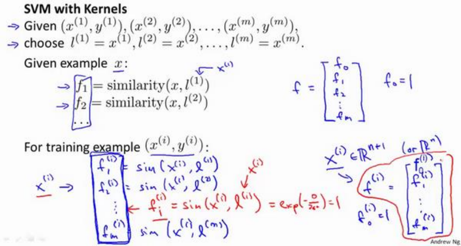

那么我们将核函数应用到SVM中:

给定$x$,计算新特征$f$,当$\theta^Tf\geq0$时,预测$y=1$,否则$y=0$.

修改代价函数为
$$
\displaystyle C\sum_{i=1}^my^{(i)}cost_1(\theta^Tf^{(i)})+(1-y^{(i)})cost_0(\theta^Tf^{(i)})+\frac{1}{2}\sum_{j=1}^m\theta_j^2
$$

在实际过程中,最后一项往往会变成$\theta^TM\theta$,其中$M$根据核函数的不同而不同,这样做主要是为了简化计算.

理论上讲，我们也可以在逻辑回归中使用核函数，但是上面使用$M$来简化计算的方法不适用与逻辑回归，因此计算将非常耗费时间。

最小化SVM的代价函数可以使用现成的软件包,但核函数需要自己编写.

SVM也可以不使用核函数,这样又称为线性核函数(linear kernel)当我们不采用非常复杂的函数,或者我们的训练集特征非常多而实例非常少的时候，可以采用这种不带核函数的支持向量机。

下面是支持向量机的两个参数𝐶和𝜎的影响：
$C=\frac{1}{\lambda}$

$C$较大时，相当于$\lambda$较小，可能会导致过拟合，高方差；

$C$较小时，相当于$\lambda$较大，可能会导致低拟合，高偏差；

$\sigma$较大时，可能会导致低方差，高偏差；

$\sigma$较小时，可能会导致低偏差，高方差。

# 使用支持向量机

在高斯核函数之外我们还有其他一些选择，如：

多项式核函数（Polynomial Kernel）

字符串核函数（String kernel）

卡方核函数（ chi-square kernel）

直方图交集核函数（histogram intersection kernel）
等等...

这些核函数的目标也都是根据训练集和地标之间的距离来构建新特征，这些核函数需要满足 Mercer's 定理，才能被支持向量机的优化软件正确处理。

多类分类问题

假设我们利用之前介绍的一对多方法来解决一个多类分类问题。如果一共有$k$个类，则我们需要$k$个模型，以及$k$个参数向量$\theta$。我们同样也可以训练$k$个支持向量机来解决多类分类问题。

但是大多数支持向量机软件包都有内置的多类分类功能，我们只要直接使用即可。

需要我们自己做的事:
1. **选择 C**
2. **选择核函数**

逻辑回归 vs SVM
$n$为特征数,$m为样本数$
1. 如果相对$m$来说,$n$很大,比如$n=10000,m\in[10,1000]$,那么应该使用逻辑回归,或是没有核函数的SVM.
2. 如果$n$很小,而$m$的大小适中,那么应该使用高斯核函数的SVM
3. 如果$n$较小,$m$较大,应该创造添加更多的特征,再使用逻辑回归或不带核函数的SVM.

