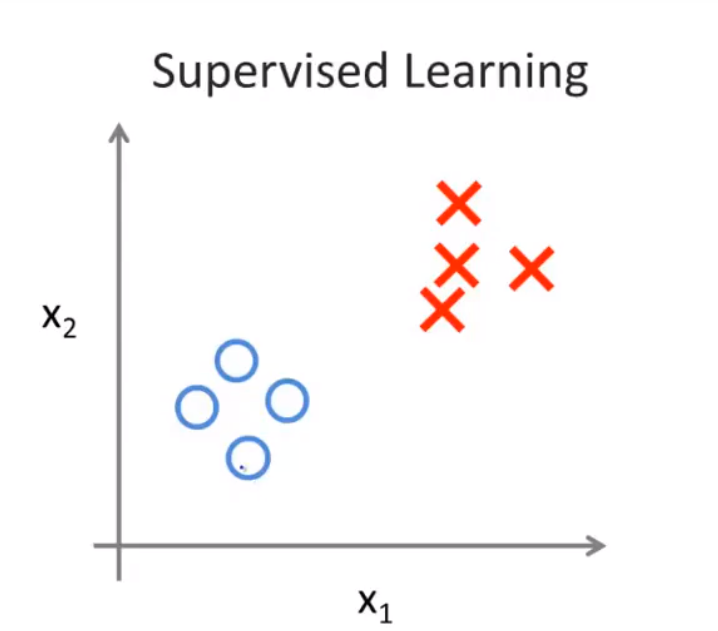
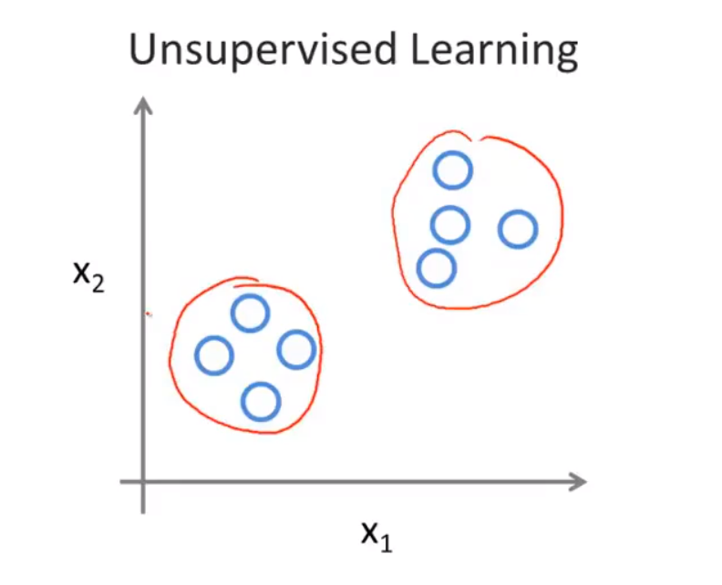

在无监督学习中，我们已知的数据。看上去有点不一样，不同于监督学习的数据的样子，即无监督学习中没有任何的标签或者是有相同的标签或者就是没标签。所以我们已知数据集，却不知如何处理，也未告知每个数据点是什么。别的都不知道，就是一个数据集。你能从数据中找到某种结构吗？针对数据集，无监督学习就能判断出数据有两个不同的聚集簇。无监督学习算法可能会把这些数据分成两个不同的簇。所以叫做**聚类算法**。事实证明，它能被用在很多地方。
