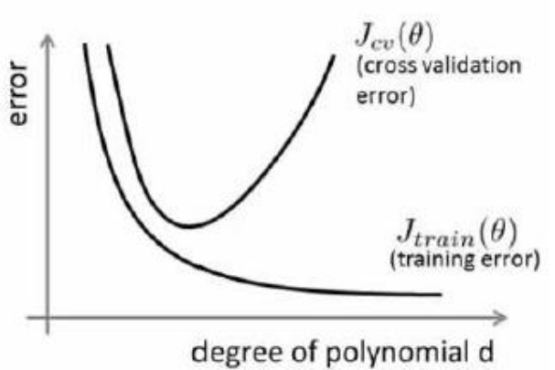
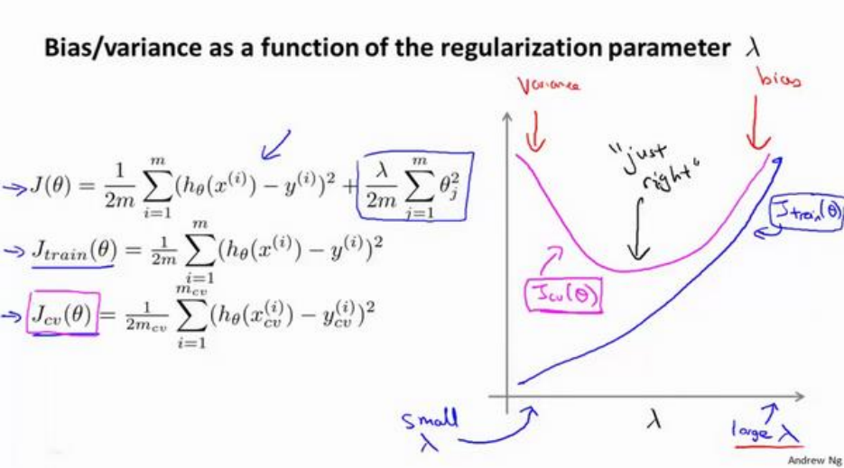
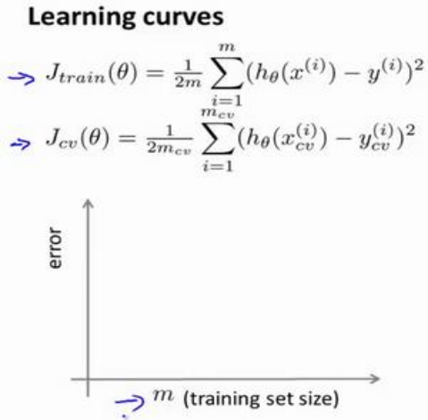
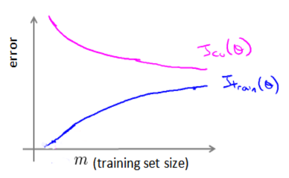
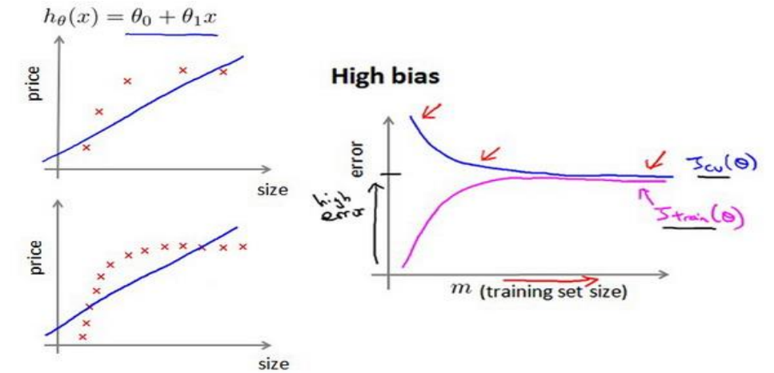
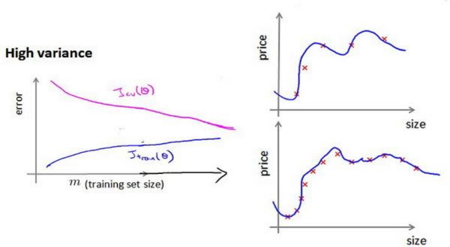

# 决定下一步做什么

当我们运用训练好了的模型来预测未知数据的时候发现有较大的误差，我们下一步可以做什
么？
获得更多的训练实例——通常是有效的，但代价较大，下面的方法也可能有效，可考虑
先采用下面的几种方法。
1. 尝试减少特征的数量
2. 尝试获得更多的特征
3. 尝试增加多项式特征
4. 尝试减少正则化程度$\lambda$
5. 尝试增加正则化程度$\lambda$

# 评估假设
判断一个假设函数是否过拟合,可以通过画出函数图像观察趋势所得.但如果特征数很多,那么就无法画出对应的图像.

这时,我们可以将数据集划分为训练集和测试集.通常我们会**随机**选取**70**%的数据作为**训练集(train)**,**30**%作为**测试集(test)**.

测试集评估在通过训练集让我们的模型学习得出其参数后，对测试集运用该模型，我们有两种方式计算误差：
1. 对于线性回归模型，我们利用测试集数据计算代价函数$J$
2. 对于逻辑回归模型，我们除了可以利用测试数据集来计算代价函数外：
$$
\displaystyle J_{test}(\theta)=-\frac{1}{m_{test}}\sum_{i=1}^{m_{test}}y_{test}^{(i)}\log h_\theta(x_{test}^{(i)})+(1-y_{test}^{(i)})\log (1-h_\theta(x_{test}^{(i)}))
$$
也可以使用误分类的比率，对于每一个测试集实例，计算：
$$
err(h_\theta(x),y)=
\begin{cases}
     1,if\;h_\theta(x)\geq0.5,y=0,or\;h_\theta(x)\leq0.5,y=1\\
     0,otherwise
\end{cases}
$$
然后对计算结果求平均。
$$
\displaystyle test\;error=\frac{1}{m_{test}}\sum_{i=1}^{m_{test}}err(h_\theta(x_{test}^{(i)}),y_{test}^{(i)})
$$

# 模型选择和交叉验证集
假设我们要在10个多项式模型中选择:
\
$
h_\theta(x)=\theta_0+\theta_1x\\
h_\theta(x)=\theta_0+\theta_1x+\theta_2x^2\\
h_\theta(x)=\theta_0+\theta_1x+\theta_2x^2+\theta_3x^3\\
\vdots\\
h_\theta(x)=\theta_0+\theta_1x+\dots+\theta_{10}x^{10}\\
$

显然越高次数的多项式模型越能够适应我们的训练数据集，但是适应训练数据集并不代表着能推广至一般情况，我们应该选择一个更能适应一般情况的模型。这时需要使用交叉验证集(cross validation,cv).

通常情况下,选取**60**%数据作为**训练集**,选取**20**%数据作为**交叉验证集**,剩下**20**%作为**测试集**.

模型选择的方法为：
1.  使用训练集训练出 10 个模型
2.  用 10 个模型分别对交叉验证集计算得出交叉验证误差（代价函数的值）
3.  选取代价函数值最小的模型
4.  用步骤 3 中选出的模型对测试集计算得出推广误差（代价函数的值）

# 诊断偏差(bias)和方差(variance)
如果一个算法的效果不太理想,通常的原因有两个:偏差过大和方差过大.偏差过大对应的情况是**欠拟合**,方差过大对应的情况是**过拟合**.

通常,我们会将训练集和交叉验证集的代价函数与多项式的次数$d$画在一张图上进行分析.

当多项式次数很小时,能拟合的数据很少,训练集误差较大.多项式次数很大时,拟合效果好,训练集误差较小.

而对于交叉验证集,误差会随着d增加先减后增,转折点就是**过拟合**的情况.

绘制出的图如下图所示

那么根据上图,我们在交叉验证集误差较大就可以判断:
1. 如果$J_{cv}(\theta)$和$J_{train}(\theta)$相差不大,那么就是偏差过大,即欠拟合的情况
2. 如果$J_{cv}(\theta)$和$J_{train}(\theta)$相差较大,那么就是方差过大,即过拟合的情况

# 正则化和偏差/方差
在我们在训练模型的过程中，一般会使用一些正则化方法来防止过拟合。但是我们可能会正则化的程度太高或太小了，即我们在选择$\lambda$的值时也需要思考与刚才选择多项式模型次数类似的问题。

通常情况下,对于$\lambda$的选取是$[0,10]$之间的呈2的倍数的关系的数,如$0,0.01,0.02,0.04,0.08,0.16,0.32,0.64,1.28,2.56,5.12,10$.同样,我们需要将数据集分为训练集,交叉验证集和测试集.

选择$\lambda$的方法为：
1. 使用训练集训练出 12 个不同程度正则化的模型
2. 用 12 个模型分别对交叉验证集计算的出交叉验证误差
3. 选择得出交叉验证误差最小的模型
4. 运用步骤 3 中选出模型对测试集计算得出推广误差

同样,我们可以将训练集和交叉验证集模型的代价函数误差与 λ 的值绘制在一张图表上

当$\lambda$较小时，训练集误差较小（过拟合）而交叉验证集误差较大

随着$\lambda$的增加，训练集误差不断增加（欠拟合），而交叉验证集误差则是先减小后增加

# 学习曲线(learning curves)
学习曲线是将训练集误差和交叉验证集误差作为训练集实例数量($m$)的函数绘制的图表.

当训练较少行数据的时候，训练的模型将能够非常完美地适应较少的训练数据，但是训练出来的模型却不能很好地适应交叉验证集数据或测试集数据.

在**偏差较大**,即**欠拟合**的情况下,增加更多的数据对误差不会有很大的提升.

在**方差较大**,即**过拟合**的情况下,增加更多的数据对误差会有很大的提升.

# 决定下一步要做什么

回到前面的6种解决方法
1. 获得更多的训练实例——解决高方差
2. 尝试减少特征的数量——解决高方差
3. 尝试获得更多的特征——解决高偏差
4. 尝试增加多项式特征——解决高偏差
5. 尝试减少正则化程度 λ——解决高偏差
6. 尝试增加正则化程度 λ——解决高方差

使用较小的神经网络，类似于参数较少的情况，容易导致高偏差和欠拟合，但计算代价较小.

使用较大的神经网络，类似于参数较多的情况，容易导致高方差和过拟合，虽然计算代价比较大，但是可以通过正则化手段来调整而更加适应数据。

通常选择较大的神经网络并采用正则化处理会比采用较小的神经网络效果要好.

对于神经网络中的隐藏层的层数的选择，通常从一层开始逐渐增加层数，为了更好地作选择，可以把数据分为训练集、交叉验证集和测试集，针对不同隐藏层层数的神经网络训练神经网络， 然后选择交叉验证集代价最小的神经网络。