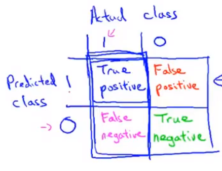

# 首先要做的事
以一个垃圾邮件分类器算法为例进行讨论。

我们首先要做的决定是如何选择并表达特征向量𝑥。我们可以选择一个由 100 个最常出现在垃圾邮件中的词所构成的列表，根据这些词是否有在邮件中出现，来获得我们的特征向量（出现为 1，不出现为 0），尺寸为 100×1。

为了构建这个分类器算法，我们可以做很多事，例如：
1. 收集更多的数据，让我们有更多的垃圾邮件和非垃圾邮件的样本
2. 基于邮件的路由信息开发一系列复杂的特征
3. 基于邮件的正文信息开发一系列复杂的特征，包括考虑截词的处理
4. 为探测刻意的拼写错误（把 watch 写成 w4tch）开发复杂的算法

# 误差分析
构建一个学习算法的推荐方法为：
1. 从一个简单的能快速实现的算法开始，实现该算法并用交叉验证集数据测试这个算
法
2. 绘制学习曲线，决定是增加更多数据，或者添加更多特征，还是其他选择
3. 进行误差分析：人工检查交叉验证集中我们算法中产生预测误差的实例，看看这些实例是否有某种系统化的趋势

以我们的垃圾邮件过滤器为例，误差分析要做的既是检验交叉验证集中我们的算法产生错误预测的所有邮件，看：是否能将这些邮件按照类分组。例如医药品垃圾邮件，仿冒品垃圾邮件或者密码窃取邮件等。然后看分类器对哪一组邮件的预测误差最大，并着手优化。

思考怎样能改进分类器。例如，发现是否缺少某些特征，记下这些特征出现的次数。例如记录下错误拼写出现了多少次，异常的邮件路由情况出现了多少次等等，然后从出现次数最多的情况开始着手优化。

误差分析并不总能帮助我们判断应该采取怎样的行动。有时我们需要尝试不同的模型，然后进行比较，在模型比较时，用数值来判断哪一个模型更好更有效，通常我们是看交叉验证集的误差。

# 类偏斜的误差度量
**类偏斜**(skewed classes)情况表现为我们的训练集中有非常多的同一种类的实例，只有很少或没有其他类的实例。

例如我们希望用算法来预测癌症是否是恶性的，在我们的训练集中，只有 0.5%的实例是恶性肿瘤。假设我们编写一个非学习而来的算法，在所有情况下都预测肿瘤是良性的，那么误差只有 0.5%。然而我们通过训练而得到的神经网络算法却有 1%的误差。这时，误差的大小是不能视为评判算法效果的依据的。

根据类的实际情况和预测情况,我们可以分出四类

查准率$precision=\frac{TP}{TP+FP}$,在所有我们预测有恶性肿瘤的病人中，实际上有恶性肿瘤的病人的百分比，越高越好。

查全率$recall=\frac{TP}{TP+FN}$,在所有实际上有恶性肿瘤的病人中，成功预测有恶性肿瘤的病人的百分比，越高越好。

# 权衡查准率和查全率

依然使用之前的癌症检测的例子.

假设我们像是自己的预测更加确定,也就是预测某个病人患有癌症时,他真的很有可能患有癌症.那么我们需要**提高**$h_\theta(x)$的**阈值**,比如从0.5改为0.7.    这样做我们会有**更高**的**查准率**,但**查全率**会**下降**.

假设我们需要避免未预测出癌症患者的情况,我们需要**降低**$h_\theta(x)$的**阈值**,比如从0.6改为0.3.这样做我们会有**更高**的**查全率**,但**查准率**会**下降**.

为了衡量查准率和查全率是否优秀,引入一个概念$F_1\;Score=2\frac{PR}{P+R}$

当查准率和查全率有一个为0时,$F_1\;Score=0$

最优情况下,二者都为1时,$F_1\;Score=1$.

# 机器学习数据

对数据的要求：要包含足够多的特征，不然白搭

对算法的要求：要包含足够的参数

