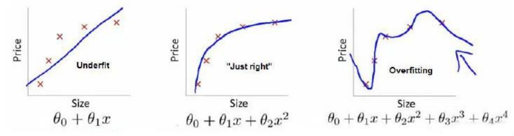

# 过拟合

对于给定的训练集，第一个模型是线性模型，**欠拟合**。第三个模型是四次方模型，属于**过拟合**，难以预测新数据。中间的模型最合适。

解决过拟合有两种方法。

1. 放弃一些特征
2. 正则化

#  代价函数
使用正则化，需要将代价函数改为
$$
\displaystyle J(\theta)=\frac{1}{2m}[\sum_{i=1}^{m}(h_\theta(x^{(i)})-y^{(i)})^2+\lambda\sum_{j=1}^n\theta_j^2]
$$

$\lambda$是正则化参数，一般不对$\theta_0$正则化处理。

上图是正则化处理和无正则化处理的对比。如果$\lambda$取值过大会导致除$\theta_0$之外的其他$\theta$都为0。故需选取合适的正则化参数。

# 正则化线性回归
正则化线性回归的代价函数为

$\displaystyle J\left(\theta\right)=\frac{1}{2m}\sum_{i=1}^{m}\left[\left(h_{\theta}(x^{(i)})-y^{(i)}\right)^2+\lambda\sum_{j=1}^{n}\theta_j^2 \right]$

此时的**梯度下降法**表达式为

$\begin{aligned}
&repeat\;until\;convergence
\{\\
&\theta_0:=\theta_0-\alpha\frac{1}{m}\sum_{i=1}^{m} (h_\theta(x^{(i)})-y^{(i)})x_0^{(i)}\\
&\theta_j:=\theta_j-\alpha[\frac{1}{m}\sum_{i=1}^{m} (h_\theta(x^{(i)})-y^{(i)})x_j^{(i)}+\frac{\lambda}{m}\theta_j]\\
\}\\
\end{aligned}$

对$j\neq0$的情况化简得
$\displaystyle\theta_j:=\theta_j(1-\alpha\frac{\lambda}{m})-\alpha\frac{1}{m}\sum_{i=1}^{m}(h_\theta(x^{(i)})-y^{(i)})x_j^{(i)}$

同样，也可以使用**正规方程**求解，此时的表达式为

$\theta=\left(X^TX+\lambda
\begin{bmatrix}
0\\
&1\\
&&1\\
&&&\ddots\\
&&&&1
\end{bmatrix}
\right)^{-1}X^Ty$

矩阵尺寸为$(n+1)\times(n+1)$。

# 正则化逻辑回归

与线性回归相同，我们给逻辑回归的代价函数表达式也加上一项。
$$
\displaystyle J(\theta)=\frac{1}{m}\sum_{i=1}^{m}\left[-y^{(i)}\log(h_\theta(x^{(i)}))-(1-y^{(i)})\log(1-h_\theta(x^{(i)}))\right]+\frac{\lambda}{2m}\sum_{j=1}^{n}\theta_j^2
$$

通过求导得到的梯度下降法表达式为

$\begin{aligned}
&repeat\;until\;convergence
\{\\
&\theta_0:=\theta_0-\alpha\frac{1}{m}\sum_{i=1}^{m} (h_\theta(x^{(i)})-y^{(i)})x_0^{(i)}\\
&\theta_j:=\theta_j-\alpha[\frac{1}{m}\sum_{i=1}^{m} (h_\theta(x^{(i)})-y^{(i)})x_j^{(i)}+\frac{\lambda}{m}\theta_j]\\
\}\\
\end{aligned}$

表达式与线性回归相同。

注意：
1.  虽然正则化的逻辑回归中的梯度下降和正则化的线性回归中的表达式看起来一样，但由于两者的$h_\theta(x)$不同所以还是有很大差别。
2.  $\theta_0$ 不参与其中的任何一个正则化。