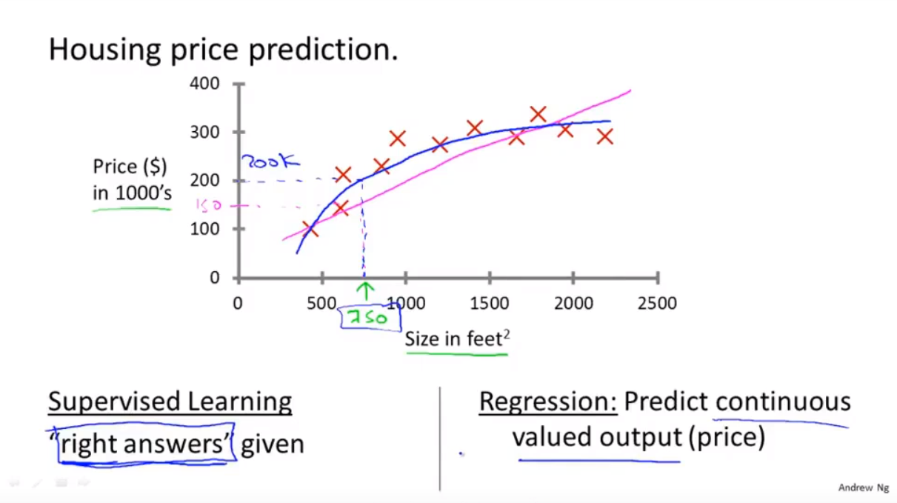

**监督学习指的就是我们给学习算法一个数据集。这个数据集由“正确答案”组成。**
# 房价预测

在房价的例子中，我们给了一系列房子的数据，我们给定数据集中每个样本的正确价格，即它们实际的售价然后运用学习算法，算出更多的正确答案。比如你朋友那个新房子的价格。用术语来讲，这叫做回归问题。我们试着推测出一个连续值的结果，即房子的价格。
**回归**这个词的意思是，我们在试着推测出这一系列连续值属性。
# 乳腺癌预测
另一个例子。假设说你想通过查看病历来推测乳腺癌良性与否，假如有人检测出乳腺肿瘤，恶性肿瘤有害并且十分危险，而良性的肿瘤危害就没那么大，所以人们显然会很在意这个问题。

这个数据集中，横轴表示肿瘤的大小，纵轴上， 1 和 0 表示是或者不是恶性肿瘤。我们之前见过的肿瘤，如果是恶性则记为 1，不是恶性，或者说良性记为 0。
这是一个**分类问题**。
分类指的是，我们试着推测出离散的输出值：0 或 1 良性或恶性，而事实上在分类问题中，输出可能不止两个值。比如说可能有三种乳腺癌，所以你希望预测离散输出 0、1、2、3。0 代表良性，1 表示第 1 类乳腺癌，2 表示第 2 类癌症，3 表示第 3 类，但这也是分类问题。
可以用不同的符号来表示这些数据来进行预测。
# 回顾
监督学习，其基本思想是，我们数据集中的每个样本都有相应的“正确答案”。再根据这些样本作出预测，就像房子和肿瘤的例子中做的那样。
我们还介绍了回归问题，即通过回归来推出一个连续的输出，之后我们介绍了分类问题，其目标是推出一组离散的结果。