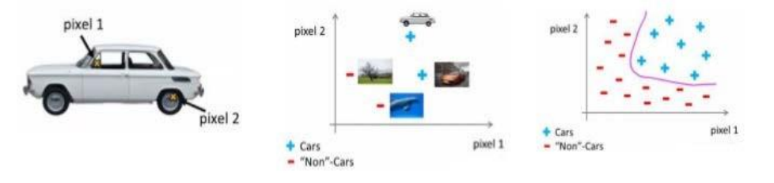
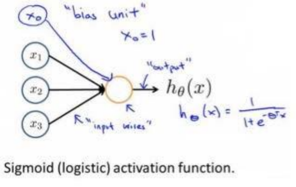
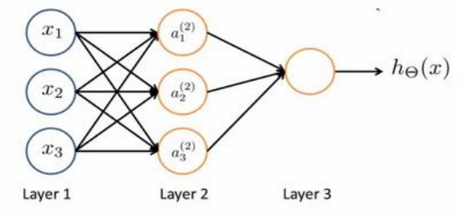
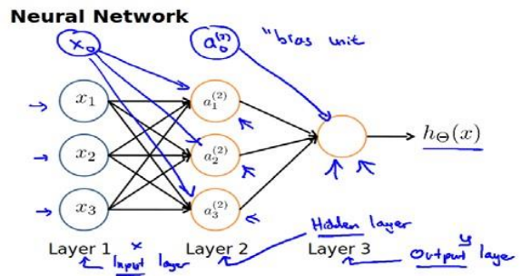
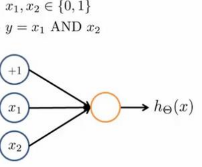
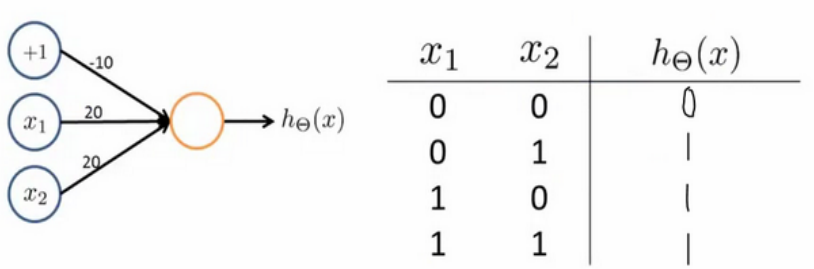
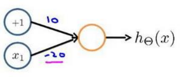
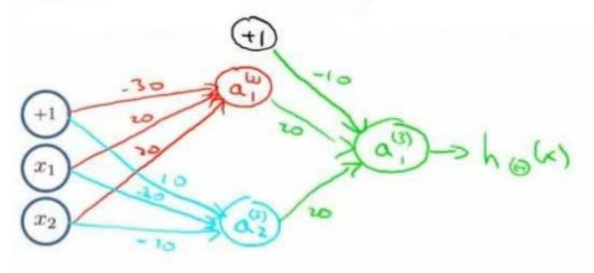

# 非线性假设
无论是线性回归还是逻辑回归都有这样一个缺点，即：当特征太多时，计算的负荷会非常大。

假设我们希望训练一个模型来识别视觉对象,例如识别一张图片上是否是一辆汽车,我们可以利用很多汽车的图片和很多非汽车的图片，然后利用这些图片上一个个像素的值（饱和度或亮度）来作为特征。

假如我们只选用灰度图片，每个像素则只有一个值（而非 RGB 值），我们可以选取图片上的两个不同位置上的两个像素，然后训练一个逻辑回归算法利用这两个像素的值来判断图片上是否是汽车：

如果采用$50\times50$的图片并将所有像素都作为特征，就有2500个特征，如果将特征两两组合构成一个多项式模型，就会有$2500^{2}/2$个特征，这时就需要神经网络。

# 模型表示
神经网络模型建立在很多神经元之上，每一个神经元又是一个个学习模型。这些神经元（也叫激活单元，activation unit）采纳一些特征作为输出，并且根据本身的模型提供一个输出。下图是一个以逻辑回归模型作为自身学习模型的神经元示例，在神经网络中，参数又可被成为权重（weight）。

我们设计出了类似于神经元的神经网络

$x_1,x_2,x_3$是输入单元，$a_1,a_2,a_3$是中间单元，最后是输出单元。

第一层是输入层，最后一层是输出层，输入层与输出层之间的层是隐藏层(hidden layer)。为每一层都添加一个偏置(bias)

其中，$a^{(j)}_i$表示第$j$层第$i$个神经元。$\theta^{(j)}$表示从第$j$层映射到第$j+1$层的权重矩阵，其尺寸为以第$j+1$层的激活单
元数量为行数，以第$j$层的激活单元数加一为列数的矩阵。

对于上图所示的模型，激活单元和输出分别表达为：
$$
a^{(2)}_1=g(\Theta^{(1)}_{10}x_0+\Theta^{(1)}_{11}x_1+\Theta^{(1)}_{12}x_2+\Theta^{(1)}_{13}x_3)\\
a^{(2)}_2=g(\Theta^{(1)}_{20}x_0+\Theta^{(1)}_{21}x_1+\Theta^{(1)}_{22}x_2+\Theta^{(1)}_{23}x_3)\\
a^{(2)}_3=g(\Theta^{(1)}_{30}x_0+\Theta^{(1)}_{31}x_1+\Theta^{(1)}_{32}x_2+\Theta^{(1)}_{33}x_3)\\
h_{\Theta}(x)=g(\Theta^{(2)}_{10}a^{(2)}_0+\Theta^{(2)}_{11}a^{(2)}_1+\Theta^{(2)}_{12}a^{(2)}_2+\Theta^{(2)}_{13}a^{(2)}_3)\\
$$
我们把这样从左到右的算法称为前向传播算法( FORWARD PROPAGATION ).

# 特征与直观理解
神经网络中，单层神经元（无中间层）的计算可用来表示逻辑运算，比如逻辑与(AND)、
逻辑或(OR)。

我们可以用这样的一个神经网络表示 AND 函数

其中$\theta_0=-30,\theta_1=20,\theta_2=20$.对于sigmoid函数，输入为较大正值，输出为 1，反之为0.

真值表

|$x_0$|$x_1$|$h_\Theta(x)$|
|---|---|---|
|0|0|0|
|0|1|0|
|1|0|0|
|1|1|1|

这样得到的函数就是$h_\Theta(x)=x_1\;AND\; x_2$

也可以生成一个OR函数

还有非（NOT）函数

我们可以使用三者组合来实现XNOR函数，XNOR的真值表为
|$x_1$|$x_2$|$h_\Theta(x)$|
|---|---|---|
|0|0|1|
|0|1|0|
|1|0|0|
|1|1|1|
即相同为1，不同为0。

$XNOR=(x_1\;AND\;x_2)OR((NOT\;x_1)\;AND\;(NOT\;x_2))$

得到的神经网络如图。

红色部分为and，青色部分为not，绿色部分为or。