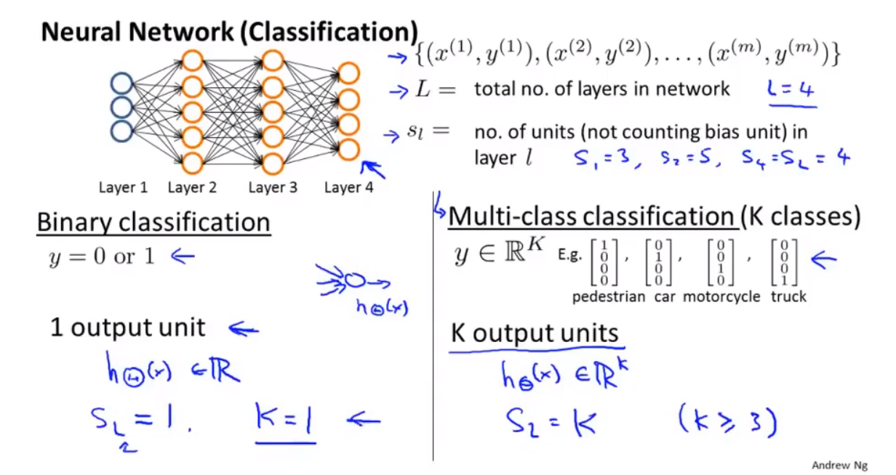
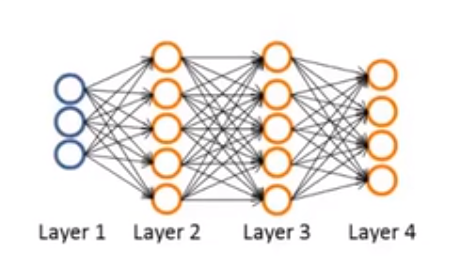
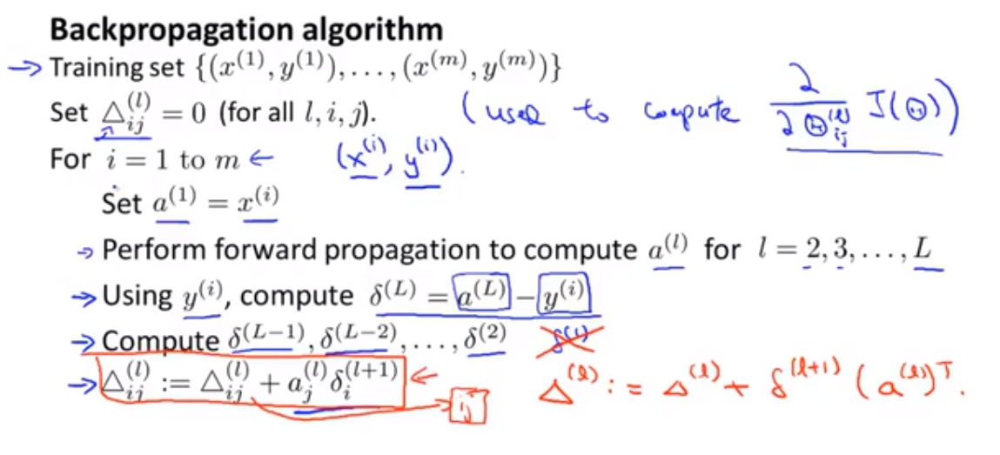
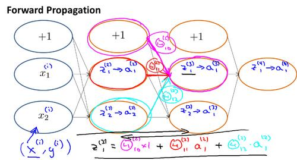
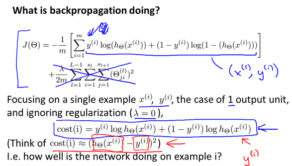
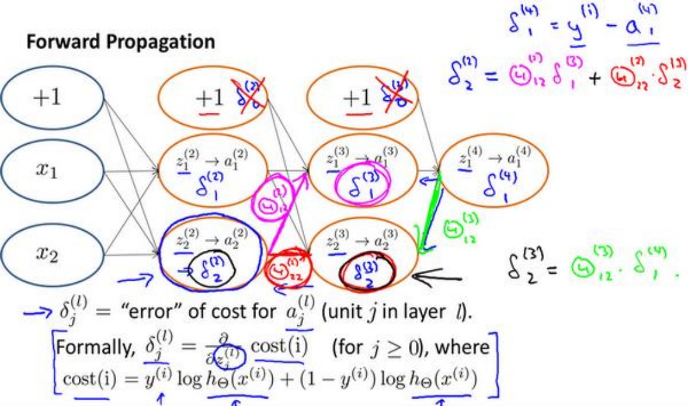
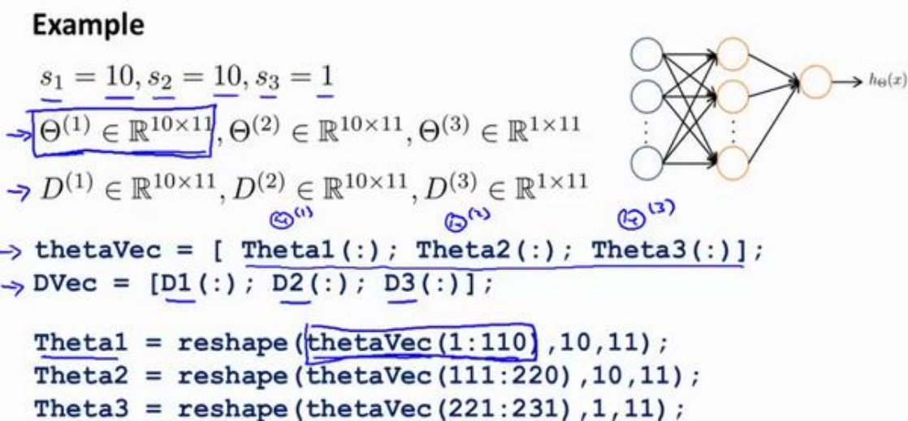
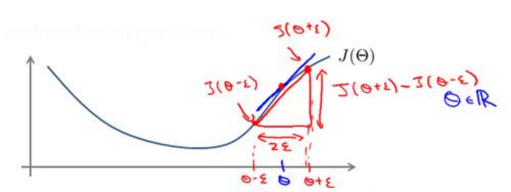
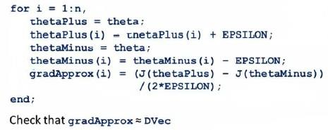
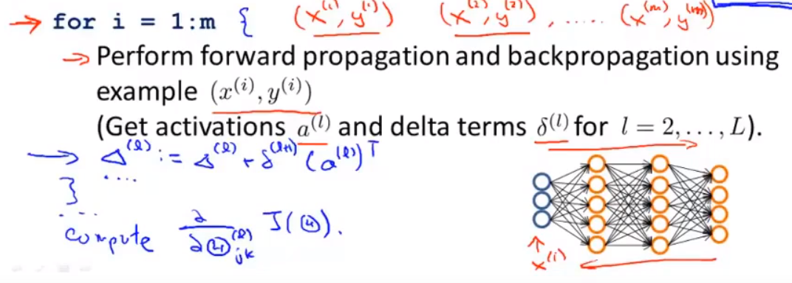

# 代价函数



这是一个神经网络的示意图，其数据集为$\left\{\left(x^{(1)},y^{(1)}\right),\left(x^{(2)},y^{(2)}\right),\cdots,\left(x^{(m)},y^{(m)}\right)\right\}$.

定义$L$为神经网络的总层数，$s_l$为第$l$层的神经元数（不包括偏置），比如$s_1=3,s_2=5,s_4=s_L=4$.

一般的二分类问题我们只需要一个输出单元，将其记作$K=1$。而如果是多分类问题($K$类)，则有$K$个输出，每个输出是一个$\mathbb{R}^k$矩阵。

与逻辑回归的代价函数相似，我们可以将多标签分类神经网络的代价函数写成
$$
\displaystyle J(\Theta)=-\frac{1}{m}\left[\sum_{i=1}^{m}\sum_{k=1}^{k}y_k^{(i)}\log\left(h_\Theta\left(x^{(i)}\right)\right)_k+\left(1-y_k^{(i)}\right)\log\left(1-\left(h_\Theta\left(x^{(i)}\right)\right)_k\right)\right]+\frac{\lambda}{2m}\sum_{l=1}^{L-1}\sum_{i=1}^{s_l}\sum_{j=1}^{s_l+1}\left(\Theta_{ji}^{(l)}\right)^2
$$
其中，$h_\Theta(x)\in\mathbb{R}^K,(h_\Theta(x))_i=i^{th}output$

与逻辑回归的思想类似，我们对$K$个预测都进行代价函数的计算。

正则化的那一项只是排除了每一层$\theta_0$后，每一层的$\theta$矩阵的和。最里层的循环$j$循环所有的行（由$s_l+1$层的激活单元数决定），循环$i$则循环所有的列，由该层（$s_l$层）的激活单元数所决定。即$h_\Theta(x)$与真实值之间的距离为每个样本-每个类输出的加和，对参数进行正则化的偏置项处理所有参数的平方和。

# 反向传播算法

反向传播算法是一种计算代价函数的偏导数$\frac{\partial}{\partial\Theta^{(l)}_{ij}}J(\Theta)$的算法。

假设我们的训练集只有一个实例$(x,y)$ ，一个4层的神经网络。   



前向传播算法为：

$
a^{(1)}=x\\
z^{(2)}=\Theta^{(1)}a^{(1)}\\
a^{(2)}=g(z^{(2)})\quad(add\;a_0^{(2)})\\
z^{(3)}=\Theta^{(2)}a^{(2)}\\
a^{(3)}=g(z^{(3)})\quad(add\;a_0^{(3)})\\
z^{(4)}=\Theta^{(3)}a^{(3)}\\
a^{(4)}=g(z^{(4)})\quad(add\;a_0^{(4)})\\
$

用$\delta$来表示误差，则$\delta^{(4)}=a^{(4)}-y$。

接着用下面的式子计算前面层的误差

$$
\delta^{(3)}=(\Theta^{(3)})^T\delta^{(4)}.*g'(z^{(3)})
$$

其中$g'(z^{(3)})$是sigmoid函数的导数，
$$
g'(z^{(3)})=a^{(3)}.*(1-a^{(3)})
$$
而$(\Theta^{(3)})^T\delta^{(4)}$是权重导致的误差的和。同理可以用
$$
\delta^{(2)}=(\Theta^{(2)})^T\delta^{(3)}.*g'(z^{(2)})
$$
计算第二层的误差。第一层时输入变量，不计算误差。

不做正则化处理的情况下，有
$$
\frac{\partial}{\partial\Theta^{(l)}_{ij}}J(\Theta)=a_j^{(l)}\delta^{(l+1)}
$$
$l$代表目前所计算的是第几层。

$j$代表目前计算层中的激活单元的下标，也将是下一层的第$j$个输入变量的下标。

$i$代表下一层中误差单元的下标，是受到权重矩阵中第$i$行影响的下一层中的误差单元的下标。

如果我们考虑正则化处理，并且我们的训练集是一个特征矩阵而非向量。在上面的特殊情况中，我们需要计算每一层的误差单元来计算代价函数的偏导数。在更为一般的情况中，我们同样需要计算每一层的误差单元，但是我们需要为整个训练集计算误差单元，此时的误差单元也是一个矩阵，我们用$\Delta_{ij}^{(l)}$来表示这个误差矩阵。第$l$层的第$i$个激活单元受到第$j$个参数影响而导致的误差。
我们的算法表示为：



即首先用正向传播方法计算出每一层的激活单元，利用训练集的结果与神经网络预测的结果求出最后一层的误差，然后利用该误差运用反向传播法计算出直至第二层的所有误差。

求出$\Delta_{ij}^{(l)}$后，就可以计算偏导数。

$$
D^{(l)}_{ij}:=\frac{1}{m}\Delta_{ij}^{(l)}+\lambda\Theta_{ij}^{(l)}\quad if\;j\neq0\\
D^{(l)}_{ij}:=\frac{1}{m}\Delta_{ij}^{(l)}\quad if\;j=0\\
$$

为了更好地理解反向传播算法，我们再来仔细研究一下前向传播的原理



反向传播做的是什么？

对于每个单独样例$x^{(i)},y^{(i)}$





# 展开参数

神经网络中，$\Theta$通常是一个矩阵，那么我们在运算中就需要将其展开为向量。



如图，使用`Theta1(:)`可以将矩阵展开为向量，使用`reshape`函数可以将向量变形为矩阵。

那么我们的学习算法要做的：
1. 初始化参数$\Theta^{(1)},\Theta^{(2)},\Theta^{(3)}$
2. 展开得到initialTheta并将其传递给
   ```matlab
   fminunc(@costFunction,initialTheta,options)

在函数
```matlab
function [jval, gradientVec] = costFunction(thetaVec)
```
中，使用后转为向量的thetaVec，通过reshape函数得到$\Theta^{(1)},\Theta^{(2)},\Theta^{(3)}$。然后使用前向传播和反向传播计算$D^{(1)},D^{(2)},D^{(3)}$和$J(\Theta)$。展开$D^{(1)},D^{(2)},D^{(3)}得到gradientVec.

# 梯度检验

当我们对一个较为复杂的模型（例如神经网络）使用梯度下降算法时，可能会存在一些
不容易察觉的错误，意味着，虽然代价看上去在不断减小，但最终的结果可能并不是最优解。
为了避免这样的问题，我们采取一种叫做梯度的数值检验（Numerical Gradient Checking）
方法。这种方法的思想是通过估计梯度值来检验我们计算的导数值是否真的是我们要求的。

对于某个特定的$\theta$，我们计算出在$\theta-\epsilon$处和$\theta-\epsilon$的
代价值（$\epsilon$是一个非常小的值，通常选取 0.001），然后求两个代价的平均，用以估计在$\theta$处的代价值。


在matlab中可写成
```matlab
gradApprox = (J(theta + eps) – J(theta - eps)) / (2*eps)
```

当$\theta$是一个向量时，我们则需要对偏导数进行检验。因为代价函数的偏导数检验只针对
一个参数的改变进行检验，下面是一个只针对𝜃1进行检验的示例：
$$
\frac{\partial}{\partial\theta_1}J(\theta)\approx\frac{J(\theta_1+\epsilon,\theta_2,\theta_3,\cdots,\theta_n)-J(\theta_1-\epsilon,\theta_2,\theta_3,\cdots,\theta_n)}{2\epsilon}
$$

具体的步骤为


# 随机初始化

在逻辑回归中，我们可以将初始参数都设为0，但是神经网络中这会导致第二层的激活单元有相同的值。因此我们需要在初始化时使用随机的方法。

通常我们会将初始值设定为$[-\epsilon,\epsilon]$之间的随机值。假设我们要随机初始一个尺寸为 10×11 的参数矩阵，那么代码为
```matlab
Theta1=rand(10,11)*(2*eps)-eps
```

# 小结

使用神经网络时，首先需要确定网络的结构。包括：
1. 输入的单元数，即训练集的特征数量
2. 输出的单元数，即类别数
3. 如果隐藏层数大于 1，确保每个隐藏层的单元个数相同，通常情况下隐藏层单元的个数越多越好。

训练神经网络需要以下步骤：
1. 随机初始化参数
2. 正向传播计算对于每个$x^{(i)}$的$h_\Theta(x^{(i)})$
3. 编写代码计算代价函数$J(\Theta)$
4. 完成反向传播代码，计算偏导数$\frac{\partial}{\partial\Theta_{jk}^{(l)}}J(\Theta)$
   


5. 使用梯度检查检验偏导数的准确性（检查完后要停用，否则速度很慢）
6. 使用梯度下降或其他优化算法，伴随反向传播使代价函数最小化

神经网络的损失函数一般是非凸函数(non-convex),但实际使用中,梯度下降和其他优化算法的表现都不错