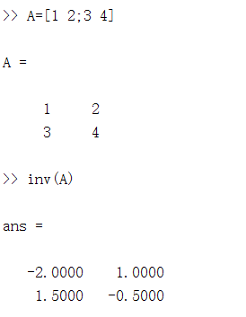
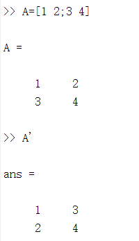

# 矩阵与向量(Matrices and Vectors)
$$
A=
\begin{bmatrix}
1402&191\\
1371&821\\
949&1437\\
147&1448\\
\end{bmatrix}
$$
矩阵的维数即行数×列数
矩阵项$A_{ij}$表示第$i$行，第$j$列元素

向量是一种特殊的矩阵，一般都是列向量，如：

$$
y=
\begin{bmatrix}
460\\
232\\
315\\
178\\
\end{bmatrix}
$$
机器学习中，**索引一般从1开始**。

# 加法和标量乘法
## 行列相等的矩阵可以相加
$$
\begin{bmatrix}
1&0\\
2&5\\
3&1\\  
\end{bmatrix}
+
\begin{bmatrix}
4&0.5\\
2&5\\
0&1\\
\end{bmatrix}
=
\begin{bmatrix}
5&0.5\\
4&10\\
3&2\\ 
\end{bmatrix}
$$

## 矩阵与标量相乘时，每一个元素都要乘
$$
3\times
\begin{bmatrix}
1&0\\
2&5\\
3&1\\  
\end{bmatrix}
=
\begin{bmatrix}
3&0\\
6&15\\
9&3\\ 
\end{bmatrix}
=
\begin{bmatrix}
1&0\\
2&5\\
3&1\\  
\end{bmatrix}
\times 3
$$

# 矩阵向量乘法
$m\times n\;$的矩阵能和$\;n\times 1\;$的向量相乘，如
$$
\begin{bmatrix}
1&3\\
4&0\\
2&1\\
\end{bmatrix}
\begin{bmatrix}
1\\
5\\
\end{bmatrix}
=
\begin{bmatrix}
16\\
4\\
7\\
\end{bmatrix}
$$

# 矩阵乘法
$m\times n\;$的矩阵能和$\;n\times o\;$的矩阵相乘，相当于矩阵和多个向量相乘
$$
\begin{bmatrix}
a&b\\
c&d\\
\end{bmatrix}
\begin{bmatrix}
e&f\\
g&h\\
\end{bmatrix}
=
\begin{bmatrix}
a\times e+b\times g&a\times f+b\times h\\
c\times e+d\times g&c\times f+d\times h\\
\end{bmatrix}
$$

# 矩阵乘法的性质
1. 矩阵乘法不满足交换律$A\times B\neq B\times A$
2. 矩阵乘法满足结合律$A\times\left(B\times C\right)=\left(A\times B\right)\times C$
3. 单位矩阵：主对角线为1，其余为只为0的矩阵，即
$$
\begin{bmatrix}
1&0&0&\cdots&0\\
0&1&0&\cdots&0\\
0&0&1&\cdots&0\\
\vdots&\vdots&\vdots&\ddots&\vdots\\
0&0&0&\cdots&1\\ 
\end{bmatrix}
$$
$\qquad$本课程中用I表示,对于单位矩阵，有
$$
AI=IA=A
$$
# 矩阵的逆和转置(Inverse and Transpose)
## 矩阵的逆
如果矩阵$A$是**方阵**$(m\times m)$有逆矩阵$A^{-1}$，则$AA^{-1}=A^{-1}A=I\\$
matlab中可以用inv函数计算逆矩阵

## 矩阵的转置
### 定义
设矩阵$\;A_{m\times n}\;$的第$\;i\;$行第$\;j\;$列元素为$A_{ij}$,则其转置矩阵$B_{n\times m}$满足$B_{ji}=A_{ij}$,即为$A^T=B$.
例：
$$
\begin{bmatrix}
a&b\\
c&d\\
e&f\\    
\end{bmatrix}
^T=
\begin{bmatrix}
c&c&e\\
b&d&f\\
\end{bmatrix}
$$
### 基本性质
$
\displaystyle 
\begin{aligned}
&(A\pm B)^T=A^T+B^T\\
&(A\times B)^T=B^T\times A^T\\
&(A^T)^T=A\\
&(kA)^T=kA^T\\   
\end{aligned}
$

matlab中转置矩阵用'表示，如图
