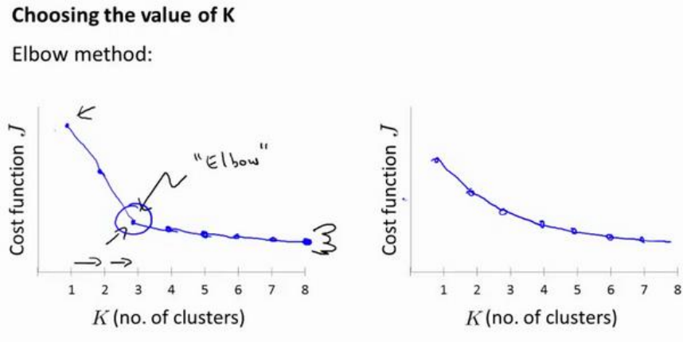

# k-means聚类算法
k-means是一种迭代算法,其步骤为
1. 选择K个随机的点，称为聚类中心（cluster centroids）；
2. 对于数据集中的每一个数据，按照距离K个中心点的距离，将其与距离最近的中心点关联起来，与同一个中心点关联的所有点聚成一类。
3. 计算每一个组的平均值，将该组所关联的中心点移动到平均值的位置。
4. 重复步骤 2-4 直至中心点不再变化。
   
用$\mu_1,\mu_2,\cdots,\mu_k$表示聚类中心(centroid),$c^{(i)}$表示第$i$个实例数据最近的中心的索引.k-means算法的伪代码如下

$
\begin{aligned}
repeat&\{\\
&for\;i=1\;to\;m\\
&c^{(i)}:=index(from\;1\;to\;K)of\;cluster\;centroid\;closest\;to\;x^{(i)}\\
&for\;k=1\;to\;K\\
&\mu_k:=average(mean)\;of\;points\;assigned\;to\;cluster\;k\\
\}    
\end{aligned}
$

# 优化目标
k-means算法的代价函数,又称畸变函数(distortion function)为:
$$
\displaystyle J(c^{(1)},\cdots,c^{(m)},\mu_1,\cdots,\mu_k)=\frac{1}{m}\sum_{i=1}^m||x^{(i)}-\mu_{c^{(i)}}||^2
$$

其中,$\mu_{c^{(i)}}$代表与$x^{(i)}$最近的聚类中心点.

#随机初始化

在运行k-means算法的之前，我们首先要随机初始化所有的聚类中心点，下面介绍怎样
做：
1. 我们应该选择$K<m$，即聚类中心点的个数要小于所有训练集实例的数量
2. 随机选择K个训练实例，然后令K个聚类中心分别与这K个训练实例相等

k-means的一个问题在于，它有可能会停留在一个局部最小值处，而这取决于初始化的情况。

解决这个问题的办法通常是多次运行k-means算法,选择代价函数最小的结果.

# 选择聚类数
选择聚类数时,有一种"肘部法则"

我们可能会得到一条类似于这样的曲线。像一个人的肘部。这就是“肘部法则”所做的，让我们来看这样一个图，看起来就好像有一个很清楚的肘在那儿。好像人的手臂，如果你伸出你的胳膊，那么这就是你的肩关节、肘关节、手。这就是“肘部法则”。你会发现这种模式，它的畸变值会迅速下降，从 1 到 2，从 2 到 3 之后，你会在 3 的时候达到一个肘点。在此之后，畸变值就下降的非常慢，看起来就像使用 3 个聚类来进行聚类是正确的，这是因为那个点是曲线的肘点，畸变值下降得很快，$K=3$之后就下降得很慢，那么我们就选$K=3$。当你应用“肘部法则”的时候，如果你得到了一个像上面这样的图，那么这将是一种用来选择聚类个数的合理方法.

在实际应用中,我们更多是根据实际需要选择聚类的个数.