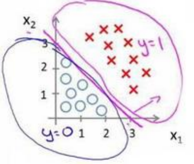

# 分类问题


图中的问题都是典型的**分类问题**，如邮件是否为垃圾邮件，金融交易是否是诈骗，肿瘤是否为良性。


如果使用线性回归解决，那么拟合出的曲线在很远处总是难以进行预测。于是需要一种方法使输出值始终在$[0,1]$，也就是**逻辑回归(logistic regression)**。

# 假说演示
逻辑回归的假设是：$h_\theta(x)=g(\theta^TX)$,式中的$g$代表的是Sigmoid函数，其表达式为$g(z)=\frac{1}{1+e^{-z}}$，其函数图像如下图。


# 判定边界
在逻辑回归中，我们预测：

当$h_\theta(x)\geq 0.5$时，预测 $y= 1$。

当$h_\theta(x)< 0.5$时，预测$y=0$。

根据上面绘制出的 S 形函数图像，我们知道当

$z= 0$ 时 $g(z)=0.5$

$z>0$ 时 $g(z)>0.5$

$z< 0$ 时 $g(z)<0.5$

又 $z=\theta^TX$ ，即：

$\theta^TX\geq 0$ 时，预测 $y=1$

$\theta^TX< 0$ 时，预测 $y=0$


对于这样的模型，我们应该绘制其分界线，假设是$x_1+x_2\geq 3$



而如果是下图的模型


可以看到绘制的分界线是一个圆形。

# 代价函数
对于线性回归模型，使用的是误差平方和，但这种计算方式并不适合逻辑回归，因为代入逻辑回归的计算式之后，得到的是一个**非凸函数**，这样会有很多**局部最小值**。

因此我们将逻辑回归的代价函数定义为:
$$
\displaystyle J(\theta)=\frac{1}{m}\sum_{i=1}^{m} \frac{1}{2}Cost(h_\theta(x^{(i)},y^{(i)}))
$$
其中
$$
Cost(h_\theta(x^{(i)},y^{(i)}))=
\begin{cases}
    -\log(h_\theta(x))&if\;y=1\\
    -\log(1-h_\theta(x))&if\;y=0\\
\end{cases}
$$

下图是$h\theta(x)$和$Cost(h_\theta(x),y)$的关系


这样构建的代价函数的特点是，当$y=1$且$h_\theta(x)=1$时误差为0，$y=1$但$h_\theta(x)\neq1$时,误差随$h_\theta(x)$减小而增大，反之亦然。

上述的$Cost(h_\theta(x),y)$可以化简为
$$
Cost(h_\theta(x),y)=-y\times\log(h_\theta(x))-(1-y)\times\log(1-h_\theta(x))
$$

代回代价函数即可得到
$$
\displaystyle J(\theta)=-\frac{1}{m}\sum_{i=1}^{m} [y^{(i)}\log(h_\theta(x^{(i)}))+(1-y^{(i)})\log(1-h_\theta(x^{(i)}))]
$$

得到代价函数后，就可使用梯度下降法求得使代价函数最小的参数

$
\begin{aligned}
repeat\{\\
&\theta_j:=\theta_j-\alpha\frac{\partial}{\partial\theta_j}J(\theta)\\
&\}\qquad (simultaneously\;update\;for\;every\;j=0,\cdots,n)\\
\end{aligned}
$

求导后得到

$
\begin{aligned}
repeat\{\\
&\theta_j:=\theta_j-\alpha-\frac{1}{m}\sum_{i=1}^{m} (h_\theta(x^{(i)})-y^{(i)})x_j^{(i)}\\
&\}\qquad (simultaneously\;update\;for\;every\;j=0,\cdots,n)\\
\end{aligned}
$

巧合的是，其表达式和线性回归的表达式相同。这里略去求导的过程。

当然，**特征缩放**也是有必要的。

除了梯度下降法之外，还有一些方法如共轭梯度（ConjugateGradient）， 局部优化法(Broyden fletcher goldfarb shann,BFGS)和 有限内存局部优化法(LBFGS).但这些方法很复杂。

fminunc 是 matlab 和 octave中都带的一个最小值优化函数，使用时我们需要提供代价函数和每个参数的求导，下面是octave 中使用 fminunc 函数的代码示例：
```matlab
function [jVal, gradient] = costFunction(theta)
    jVal = [...code to compute J(theta)...];
    gradient = [...code to compute derivative of J(theta)...];
end
options = optimset('GradObj', 'on', 'MaxIter', '100');
initialTheta = zeros(2,1);
[optTheta, functionVal, exitFlag] = fminunc(@costFunction, initialTheta, options);
```

