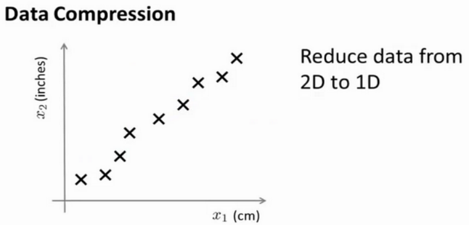
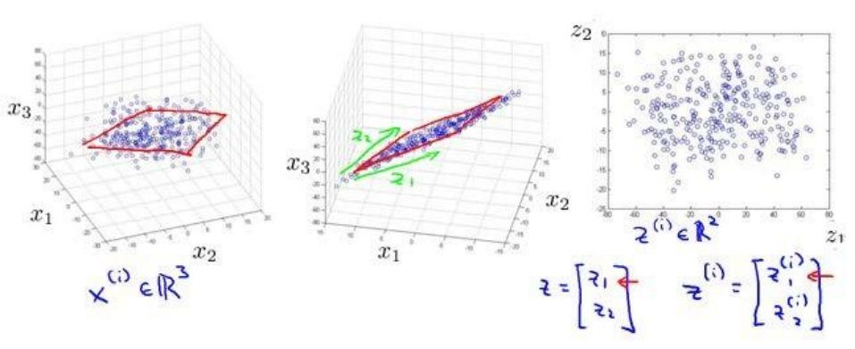
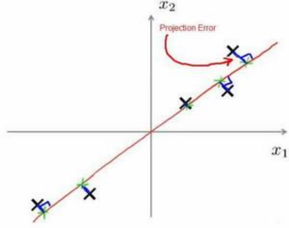

# 动机一:数据压缩
假设我们有两个未知的特征$x_1,x_2$,$x_1$用厘米表示物体的长度,$x_2$用英寸.



所以，这给了我们高度冗余表示，也许不是两个分开的特征$x_1$和$x_2$，这两个基本的长度度量，也许我们想要做的是减少数据到一维，只有一个数测量这个长度。这个例子似乎有点做作，这里厘米英寸的例子实际上不是那么不切实际的，两者并没有什么不同。

将数据从三维降至二维： 这个例子中我们要将一个三维的特征向量降至一个二维的特征向量。过程是与上面类似的，我们将三维向量投射到一个二维的平面上，强迫使得所有的数据都在同一个平面上，降至二维的特征向量。



# 动机二:数据可视化

假使我们有有关于许多不同国家的数据，每一个特征向量都有 50 个特征（如 GDP，人均 GDP，平均寿命等）。如果要将这个 50 维的数据可视化是不可能的。使用降维的方法将其降至 2 维，我们便可以将其可视化了。

# 主成分分析问题

主成分分析(PCA,Principal Component Analysis)是最常见的降维算法.

在PCA中,我们需要找到一个方向向量,使得所有点的投射平均均方误差能尽可能地小.**方向向量**是一个经过原点的向量，而**投射误差**是从特征向量向该方向向量作**垂线**的长度。



PCA的问题描述即将$n$维数据降至$k$维，目标是找到向量$u^{(1)},u^{(2)},u^{(3)}$使得总的投射误差最小。

PCA与线性回归乍看有些类似,但其实是两种不同的算法.主成分分析最小化的是投射误差（Projected
Error），而线性回归尝试的是最小化预测误差。线性回归的目的是预测结果，而主成分分析不作任何预测。

PCA 将$n$个特征降维到$k$个，可以用来进行数据压缩，如果 100 维的向量最后可以用 10维来表示，那么**压缩率**为 90%。同样图像处理领域的 KL 变换使用 PCA 做图像压缩。但 PCA要保证降维后，还要保证数据的特性损失最小。

PCA 技术的一大好处是对数据进行降维的处理。我们可以对新求出的“主元”向量的**重要性进行排序**，根据需要取前面最重要的部分，将后面的维数省去，可以达到降维从而简化模型或是对数据进行压缩的效果。同时最大程度的保持了原有数据的信息。

PCA 技术的一个很大的优点是，它是**完全无参数限制**的。在 PCA 的计算过程中完全不需要人为的设定参数或是根据任何经验模型对计算进行干预，最后的结果只与数据相关，与用户是独立的。

但是，这一点同时也可以看作是缺点。如果用户对观测对象有一定的先验知识，掌握了数据的一些特征，却无法通过参数化等方法对处理过程进行干预，可能会得不到预期的效果，效率也不高。

# 主成分分析算法

1. 均值归一化.计算出所有的均值,令$x_j=x_j-\mu_j$,如果在不同的数量级上,还要进行特征缩放.
2. 计算协方差矩阵(covariance matrix)
   $$\displaystyle \Sigma=\frac{1}{m}\sum_{i=1}^{m}(x^{(i)})(x^{(i)})^T$$
3. 计算协方差矩阵$\Sigma$的特征向量(eigenvectors),在matlab中可以用奇异值分解(singular value decomposition)
```matlab
[U, S,V]= svd(sigma)
```
4. 对于$n\times n$的矩阵,上式中的$U$是一个具有与数据之间最小投射误差的方向向量构成的矩阵.如果我们希望将其降至$k$维,我们只需取$U$的前$k$个向量,获得一个$n\times k$的矩阵,表示为$U_{reduce}$,然后通过$z^{(i)}=U^T_{reduce}*x^{(i)}$计算新的特征向量$z^{(i)}$.其中$x$是$n\times 1$维的，因此结果为$k\times 1$维度。
   
# 压缩重现

对于给定的$z^{(i)}$,如何得到原来的$x^{(i)}$?

其做法为$x_{approx}=U_{reduce}\cdot z$,$x_{approx}$是一个近似值.

# 主成分数量选择
主要成分分析是减少投射的平均均方误差.

已知训练集的方差为$\displaystyle \frac{1}{m}\sum_{i=1}^m||x^{(i)}||^2$.我们希望在平均均方误差与训练集方差的**比例**尽可能小的情况下选择尽可能小的$k$值.

一种可行的方法是先令$k=1$，然后进行主要成分分析，获得$U_{reduce}$和$z$，然后计算比例是否小于1%。如果不是的话再令$k=2$，如此类推，直到找到可以使得比例小于 1%的最小$k$值.

在matlab中有更方便的方法.在使用`svd`函数时,会获得三个参数
```matlab
[U, S,V]= svd(sigma)
```
其中$S$是一个$n\times n$的矩阵,
$$
\begin{bmatrix}
    S_{11}&0&\cdots&0\\
    0&S_{22}&\cdots&0\\
    \vdots&\vdots&\ddots&\vdots\\
    0&0&\cdots&S_{nn}\\
\end{bmatrix}
$$
只有对角线上有值,其余位置全是0.我们可以使用这个矩阵来计算平均均方误差与训练集方差的比例.
$$
\displaystyle \frac{\frac{1}{m}\sum_{i=1}^m||x^{(i)}-x_{approx}^{(i)}||^2}{\frac{1}{m}\sum_{i=1}^m||x^{(i)}||^2}=1-\frac{\sum_{i=1}^kS_{ii}}{\sum_{i=1}^nS_{ii}}\leq1\%
$$
即
$$
\frac{\sum_{i=1}^kS_{ii}}{\sum_{i=1}^nS_{ii}}\geq99\%
$$

# PCA的应用建议
错误的主要成分分析情况：
1. 使用主要成分分析的情况是，将其用于**减少过拟合**（减少了特征的数量）。这样做非常不好，不如尝试**正则化处理**。原因在于主要成分分析只是近似地丢弃掉一些特征，它并不考虑任何与结果变量有关的信息，因此可能会丢失非常重要的特征。然而当我们进行正则化处理时，会考虑到结果变量，不会丢掉重要的数据。
2. **默认**地将主要成分分析作为学习过程中的一部分，这虽然很多时候有效果，最好还是从所有原始特征开始，只在**有必要**的时候（算法运行太慢或者占用太多内存）才考虑采用主要成分分析。